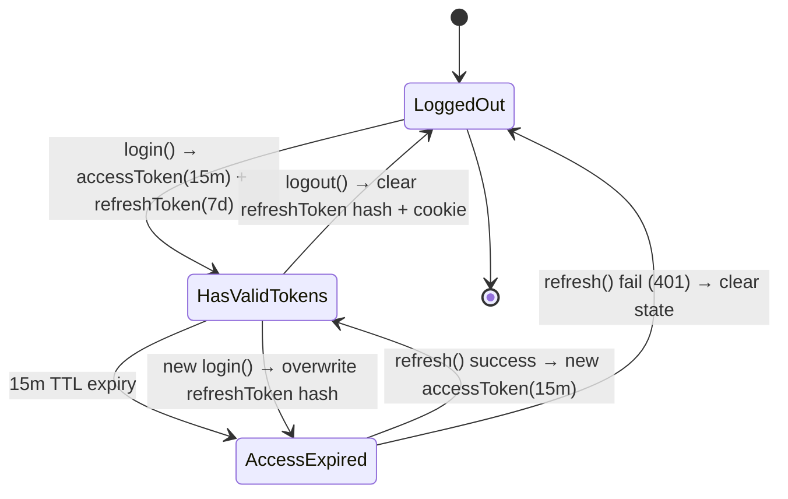
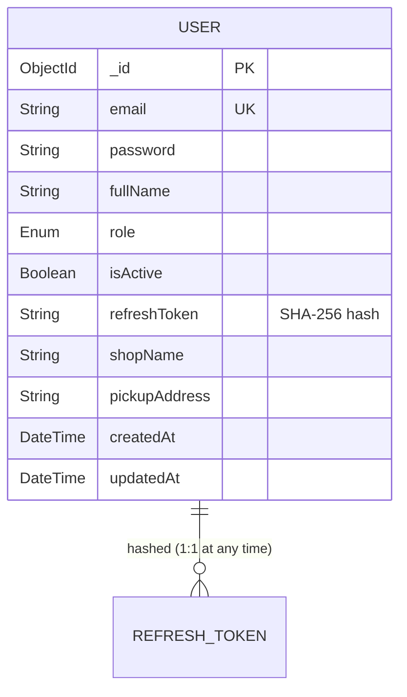

# Domain Model — US-AUTH-002 (auth-refresh-logout)

## RBAC Matrix

| Action | Customer | Admin | Guest |
|--------|:--------:|:-----:|:-----:|
| POST /auth/register | ❌ | ❌ | ✅ |
| POST /auth/login | ❌ | ❌ | ✅ |
| POST /auth/refresh | ✅ | ✅ | ❌ |
| POST /auth/logout | ✅ | ✅ | ❌ |
| GET /users/me | ✅ | ✅ | ❌ |

**Notes:**
- Refresh endpoint uses `JwtRefreshGuard` (cookie-based, no role check — any valid refresh token works)
- Logout uses `JwtAuthGuard` (requires valid access token)
- Banned users (`isActive=false`) blocked at login (403) and refresh (401)

## State Machine — Token Lifecycle



**States:**
- `LoggedOut`: No valid tokens
- `HasValidTokens`: Both accessToken (memory) and refreshToken (cookie+DB hash) valid
- `AccessExpired`: Access token expired, refresh token still valid

**Transitions:**
- `login()`: Issues new token pair, overwrites any existing refresh token hash
- `refresh()`: Validates refresh token hash + `isActive=true` → issues new access token
- `logout()`: Clears refresh token hash in DB, clears cookie
- `ban user`: Sets `isActive=false` → subsequent refresh attempts fail with 401

## Business Rules (BR-)

| ID | Rule | Description |
|----|------|-------------|
| BR-AUTH-007 | Access Token TTL | 15 minutes (`JWT_ACCESS_EXPIRES_IN`) |
| BR-AUTH-008 | Refresh Token TTL | 7 days (`JWT_REFRESH_EXPIRES_IN`) |
| BR-AUTH-009 | Refresh Token Hashing | SHA-256 hash stored in `users.refreshToken` |
| BR-AUTH-010 | Cookie Transport | httpOnly, Path=/api/v1/auth, SameSite=Lax, Secure=production |
| BR-AUTH-011 | Banned User Block | `isActive=false` → 401 on refresh, 403 on login |
| BR-AUTH-012 | Logout Clears State | `refreshToken=null` in DB, `clearCookie()` on response |
| BR-AUTH-013 | Auto-Refresh on 401 | Axios interceptor retries once with `isRefreshing` queue guard |
| BR-AUTH-014 | Refresh Failure → Logout | Failed refresh clears Zustand auth + redirects to `/login` |
| BR-AUTH-015 | Single Active Session | New login overwrites refresh token hash |

## Entity Relationships (ERD)



**Note:** Refresh token is stored as a single hash field on User document (not separate collection). Overwrite on new login enforces single session.

## Non-Functional Requirements

| Category | Requirement |
|----------|-------------|
| **Security** | Refresh token never exposed in response body; httpOnly cookie only |
| **Security** | SHA-256 hash prevents token replay if DB compromised |
| **Security** | `isActive` check on every refresh prevents banned user access |
| **Performance** | Refresh endpoint < 100ms p99 (single DB lookup + JWT sign) |
| **Reliability** | Idempotent refresh: concurrent 401s queued, single refresh call |
| **Observability** | Structured logs on refresh success/failure, logout |
| **Compatibility** | Cookie `Path=/api/v1/auth` scoped to auth endpoints only |

## Updated CONTEXT.md Entries

```markdown
- **BR-AUTH-007..015**: Auth token lifecycle business rules
- **ASM-AUTH-002-001..003**: Assumptions from elicitation interview
- **JwtRefreshStrategy**: Passport strategy extracting token from cookie
- **isRefreshing queue**: Frontend guard preventing refresh storms
```

## Next Stage
Proceed to **risk-contradiction-scanner** (Stage 5)