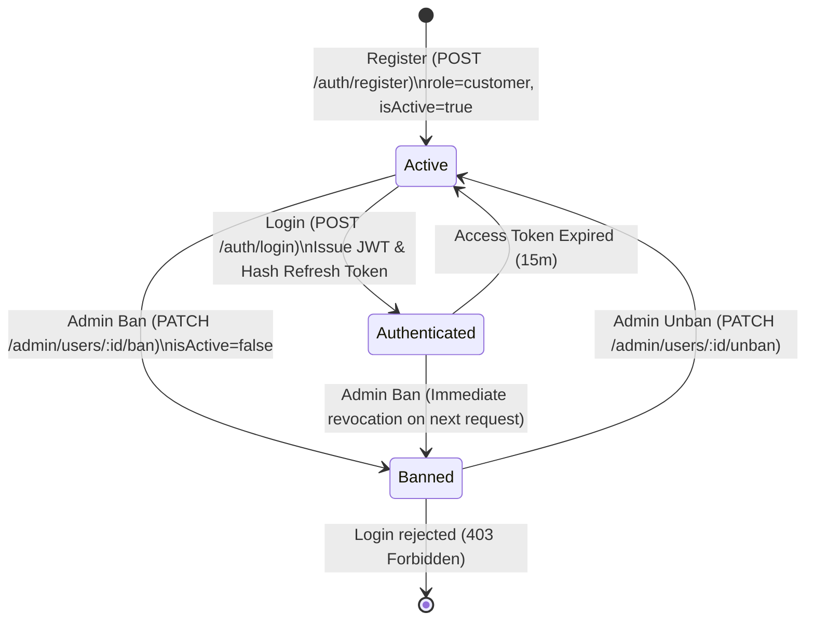
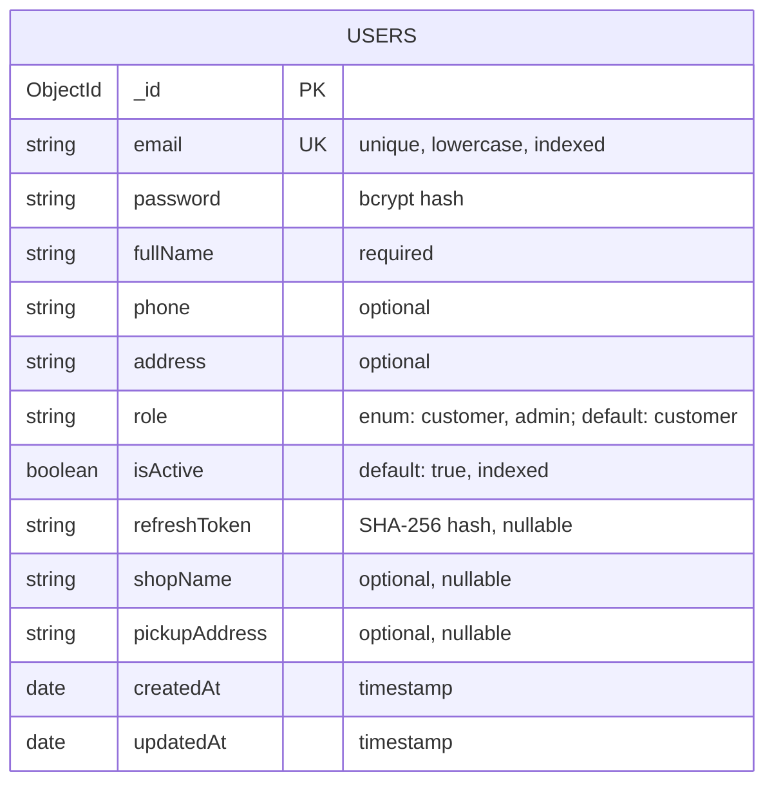

# 02 - Domain Model: US-AUTH-001 (auth-register-login)

## 1. RBAC Matrix

| Role         | Endpoint: `POST /auth/register` | Endpoint: `POST /auth/login` | Session Behavior                     |
| :----------- | :------------------------------ | :--------------------------- | :----------------------------------- |
| **Guest**    | Allowed (creates `customer`)    | Allowed (authenticates)      | No token present before login        |
| **Customer** | N/A (Already registered)        | Allowed                      | Issues Access Token + Refresh Cookie |
| **Admin**    | N/A (Seeded account only)       | Allowed                      | Issues Access Token + Refresh Cookie |

---

## 2. User Lifecycle State Machine

---

## 3. Business Rules Index (BR-AUTH)

- **`BR-AUTH-001`**: Email must be unique across all users. Attempting to register an existing email returns `409 Conflict`.
- **`BR-AUTH-002`**: Password must be hashed with bcrypt (cost factor 10) before persisting in MongoDB. Plaintext password is never stored or returned in any response.
- **`BR-AUTH-003`**: Access Token validity is 15 minutes (`JWT_ACCESS_EXPIRES_IN=15m`). Refresh Token validity is 7 days (`JWT_REFRESH_EXPIRES_IN=7d`).
- **`BR-AUTH-004`**: Public registration always creates users with `role: 'customer'`. Admin accounts cannot be created via public API; seeded only.
- **`BR-AUTH-007`**: Users with `isActive: false` are prohibited from logging in (`403 Forbidden: "Tài khoản đã bị khóa"`).
- **`BR-AUTH-008`**: Password must contain at least 8 characters.
- **`BR-AUTH-009`**: Immediate ban enforcement: `JwtStrategy.validate` must check user status in MongoDB; banned users receive 403 on protected calls.
- **`BR-AUTH-010`**: Refresh token is hashed using SHA-256 before storage in `users.refreshToken`. Only 1 active refresh token per user (new login overwrites old).

---

## 4. Entity-Relationship & Schema Definition

