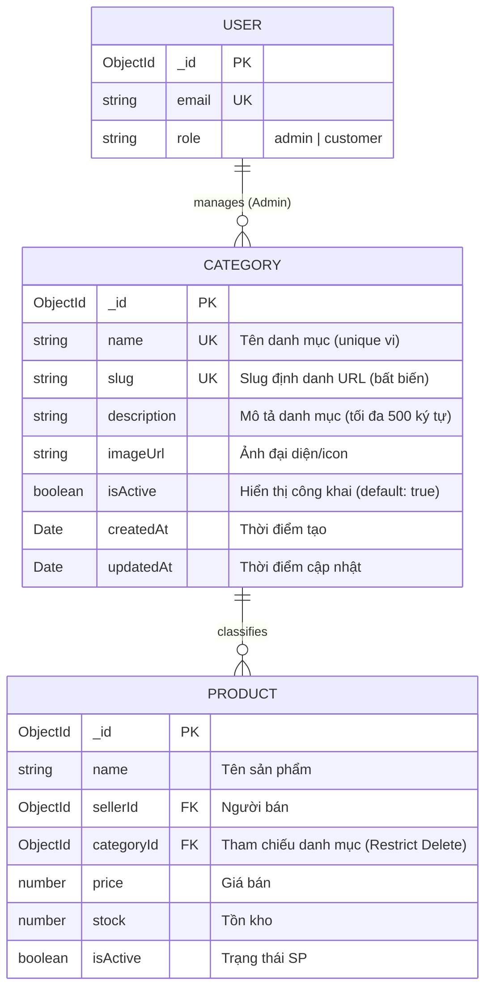
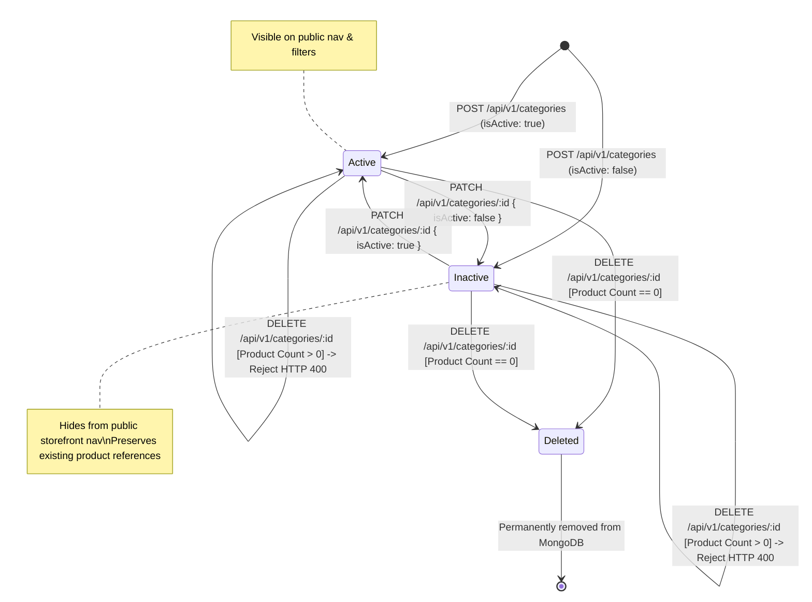

# Domain Model — US-CAT-001 (category-management)

- **Feature ID:** `US-CAT-001`
- **Feature Slug:** `category-management`
- **Stage:** Stage 4 — Domain Modeling Light (Bounded Task)

---

## 1. Domain Entities & Schemas

### 1.1 Category Entity (`Category`)
The `Category` entity represents a system-wide product classification taxonomy. Categories are globally managed by marketplace administrators; sellers select from existing categories when creating or editing products.

```typescript
export interface CategoryEntity {
  id: string;               // MongoDB ObjectID string
  name: string;             // Unique display name (2-50 characters)
  slug: string;             // Auto-generated URL slug (unique, immutable)
  description?: string;     // Optional textual description (max 500 characters)
  imageUrl?: string;        // Optional category banner/thumbnail URL
  isActive: boolean;        // Visibility toggle (default: true)
  createdAt: Date;          // Timestamp of creation
  updatedAt: Date;          // Timestamp of last modification
}
```

### 1.2 Mongoose Schema Design
- **Collection Name:** `categories`
- **Indexes:**
  - `{ name: 1 }` with `{ unique: true, collation: { locale: 'vi', strength: 2 } }` (Case-insensitive & diacritic-aware uniqueness)
  - `{ slug: 1 }` with `{ unique: true }`
  - `{ isActive: 1 }` (Optimized query filter for public storefront queries)

```typescript
// backend/src/categories/schemas/category.schema.ts
import { Prop, Schema, SchemaFactory } from '@nestjs/mongoose';
import { HydratedDocument } from 'mongoose';

export type CategoryDocument = HydratedDocument<Category>;

@Schema({ timestamps: true })
export class Category {
  @Prop({
    required: true,
    unique: true,
    trim: true,
    minlength: 2,
    maxlength: 50,
  })
  name: string;

  @Prop({
    required: true,
    unique: true,
    trim: true,
    lowercase: true,
  })
  slug: string;

  @Prop({
    required: false,
    trim: true,
    maxlength: 500,
    default: '',
  })
  description?: string;

  @Prop({
    required: false,
    trim: true,
    default: null,
  })
  imageUrl?: string;

  @Prop({
    required: true,
    default: true,
    index: true,
  })
  isActive: boolean;
}

export const CategorySchema = SchemaFactory.createForClass(Category);
```

---

## 2. Entity Relationship Diagram (ERD)



---

## 3. RBAC Matrix (Role-Based Access Control)

| Action | Route | Public / Guest | Customer / Seller | Admin | Guard Pipeline |
|---|---|:---:|:---:|:---:|---|
| Browse Active Categories | `GET /api/v1/categories` | ✅ Allowed | ✅ Allowed | ✅ Allowed | None (Public) |
| Get Category by ID/Slug | `GET /api/v1/categories/:id` | ✅ Active only | ✅ Active only | ✅ All | Optional Jwt / Public Filter |
| List All Categories (Admin) | `GET /api/v1/admin/categories` | ❌ 401 | ❌ 403 | ✅ Allowed | `JwtAuthGuard` + `RolesGuard(Admin)` |
| Create New Category | `POST /api/v1/categories` | ❌ 401 | ❌ 403 | ✅ Allowed | `JwtAuthGuard` + `RolesGuard(Admin)` |
| Update Category | `PATCH /api/v1/categories/:id` | ❌ 401 | ❌ 403 | ✅ Allowed | `JwtAuthGuard` + `RolesGuard(Admin)` |
| Delete Category | `DELETE /api/v1/categories/:id` | ❌ 401 | ❌ 403 | ✅ Allowed | `JwtAuthGuard` + `RolesGuard(Admin)` |

---

## 4. State Machine: Category Lifecycle



---

## 5. Core Business Rules

| Rule ID | Statement | Enforcement Layer | Error Code |
|---|---|---|---|
| **BR-CAT-001** | Admin role required for all mutating endpoints (`POST`, `PATCH`, `DELETE`). | `JwtAuthGuard`, `RolesGuard(Admin)` | 401 / 403 |
| **BR-CAT-002** | Category `name` must be between 2 and 50 characters, trimmed, and unique across the system (case-insensitive). | `class-validator`, MongoDB unique index | 400 / 409 Conflict |
| **BR-CAT-003** | Category `slug` is auto-generated upon `POST` using Vietnamese transliteration to lower kebab-case. | Service layer | 400 |
| **BR-CAT-004** | Category `slug` is immutable: updates to `name` via `PATCH` DO NOT alter `slug`. | Service layer / DTO exclusion | N/A |
| **BR-CAT-005** | `description` is optional with maximum length of 500 characters. | `class-validator` `@MaxLength(500)` | 400 Bad Request |
| **BR-CAT-006** | `imageUrl` is optional; if provided, must be a valid URI string. | `class-validator` `@IsUrl()` / `@IsOptional()` | 400 Bad Request |
| **BR-CAT-007** | `isActive` defaults to `true`. When `false`, the category is hidden from public navigation. | Mongoose default + Service query filter | N/A |
| **BR-CAT-008** | Public `GET /api/v1/categories` returns only documents with `isActive = true`. | CategoryService `findAll({ isActive: true })` | 200 OK |
| **BR-CAT-009** | Deletion requires zero product associations. Backend counts all products where `category = categoryId`. | CategoryService before `deleteOne()` | N/A |
| **BR-CAT-010** | If referenced product count > 0, `DELETE /api/v1/categories/:id` rejects with HTTP 400: `"Không thể xóa danh mục đang có {count} sản phẩm liên kết"`. | CategoryService `BadRequestException` | 400 Bad Request |
