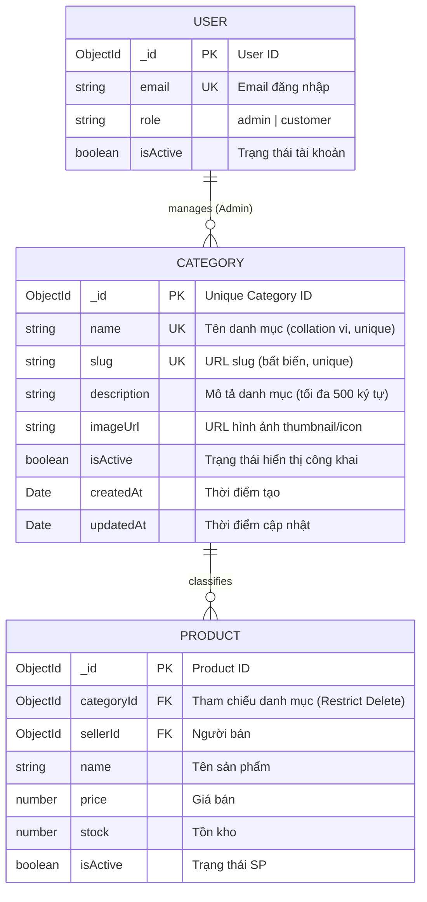
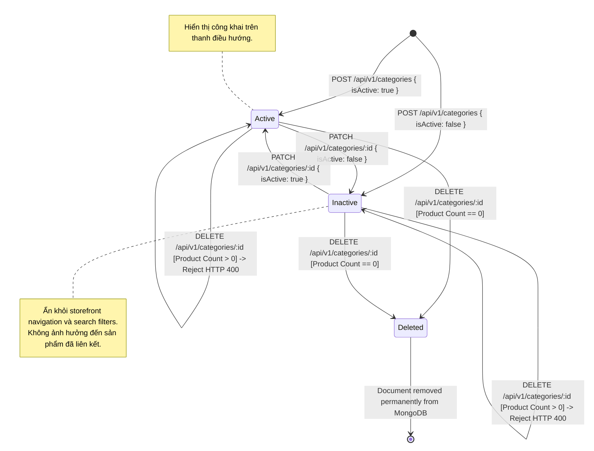
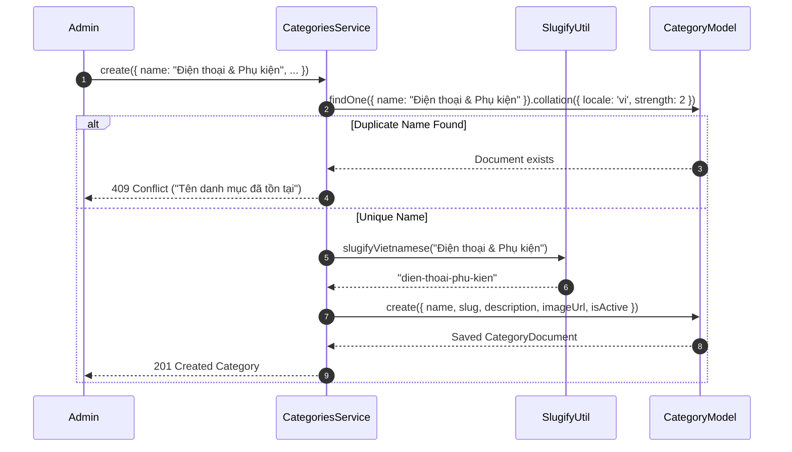
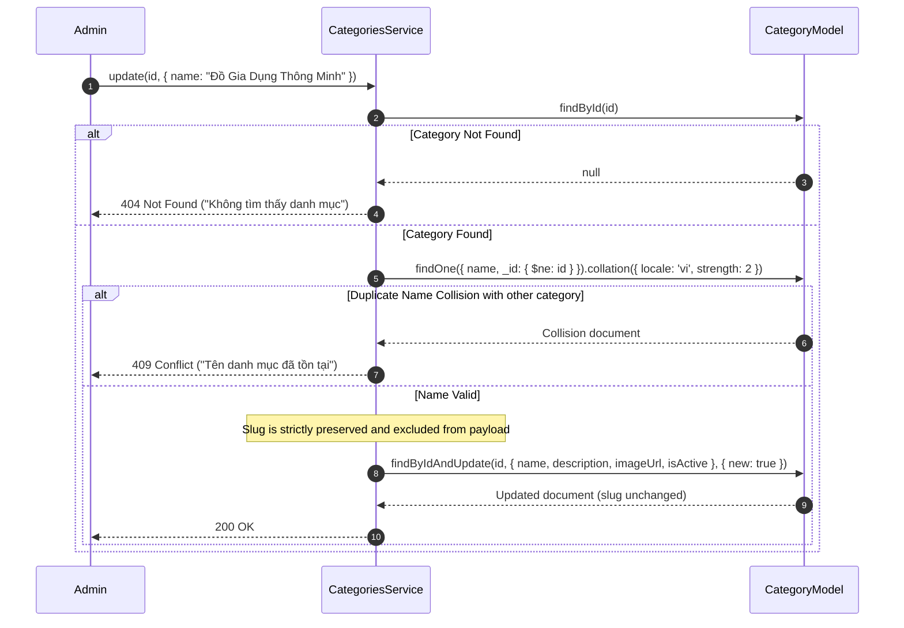

# Data Model: Category Management (US-CAT-001)

## 1. Entity Overview

The Category Management feature introduces the `Category` domain entity, representing the system-wide product classification taxonomy. Categories are globally maintained by platform administrators and consumed by sellers (when listing products) and shoppers (when browsing the storefront).

---

## 2. Database Schema: `Category`

**Collection Name:** `categories`  
**Database:** MongoDB  
**ODM:** Mongoose

### 2.1 Field Specifications

| Field | Type | Required | Constraints | Default | Description |
|---|---|:---:|---|---|---|
| `_id` | `ObjectId` | Yes | Auto-generated PK | Auto | Unique MongoDB Identifier |
| `name` | `string` | Yes | Length: 2–50 chars, trimmed, unique (vi collation) | — | Display name of the category |
| `slug` | `string` | Yes | Kebab-case, lowercase, trimmed, unique, immutable | — | URL-friendly identifier for routing & SEO |
| `description` | `string` | No | Plain text, max 500 chars, trimmed | `""` | Optional category summary |
| `imageUrl` | `string` | No | Valid HTTP/HTTPS URI string | `null` | Optional thumbnail/icon image URL |
| `isActive` | `boolean` | Yes | Indexed | `true` | Public visibility flag (`false` hides from public nav) |
| `createdAt` | `Date` | Yes | ISO 8601 Timestamp | `now()` | Timestamp of creation |
| `updatedAt` | `Date` | Yes | ISO 8601 Timestamp | `now()` | Timestamp of last modification |

### 2.2 MongoDB Indexes

```javascript
// 1. Case-insensitive and diacritic-aware uniqueness for Vietnamese category names
db.categories.createIndex(
  { name: 1 },
  {
    unique: true,
    collation: { locale: 'vi', strength: 2 },
    name: 'uniq_category_name_vi'
  }
);

// 2. Strict unique index for URL slugs
db.categories.createIndex(
  { slug: 1 },
  {
    unique: true,
    name: 'uniq_category_slug'
  }
);

// 3. Fast filter index for public storefront queries
db.categories.createIndex(
  { isActive: 1 },
  {
    name: 'idx_category_is_active'
  }
);
```

### 2.3 Mongoose Schema Definition

```typescript
// backend/src/categories/schemas/category.schema.ts
import { Prop, Schema, SchemaFactory } from '@nestjs/mongoose';
import { HydratedDocument } from 'mongoose';

export type CategoryDocument = HydratedDocument<Category>;

@Schema({
  timestamps: true,
  collection: 'categories',
})
export class Category {
  @Prop({
    type: String,
    required: true,
    trim: true,
    minlength: 2,
    maxlength: 50,
  })
  name: string;

  @Prop({
    type: String,
    required: true,
    trim: true,
    lowercase: true,
  })
  slug: string;

  @Prop({
    type: String,
    required: false,
    trim: true,
    maxlength: 500,
    default: '',
  })
  description?: string;

  @Prop({
    type: String,
    required: false,
    trim: true,
    default: null,
  })
  imageUrl?: string;

  @Prop({
    type: Boolean,
    required: true,
    default: true,
  })
  isActive: boolean;

  createdAt: Date;
  updatedAt: Date;
}

export const CategorySchema = SchemaFactory.createForClass(Category);

// Indexes
CategorySchema.index(
  { name: 1 },
  { unique: true, collation: { locale: 'vi', strength: 2 } },
);
CategorySchema.index({ slug: 1 }, { unique: true });
CategorySchema.index({ isActive: 1 });
```

---

## 3. Cross-Collection Relationships & ERD



### 3.1 Referential Integrity Rule (BR-CAT-009 & BR-CAT-010)

Before executing `Category.deleteOne({ _id: id })`, the system queries the `Product` collection to verify that no products reference the given category:

```typescript
const count = await productModel.countDocuments({
  $or: [
    { category: new Types.ObjectId(id) },
    { categoryId: new Types.ObjectId(id) },
  ],
});

if (count > 0) {
  throw new BadRequestException(
    `Không thể xóa danh mục đang có ${count} sản phẩm liên kết`,
  );
}
```

If the `Product` model has not yet been registered or initialized in the Mongoose connection (per `ASM-CAT-001-006`), `productModel` resolves safely to null/zero count, and the delete operation proceeds.

---

## 4. State Machine: Category Lifecycle



---

## 5. Sequence Flows & Concurrency Handling

### 5.1 Category Creation & Vietnamese Slugification



### 5.2 Category Name Update (Slug Immutability Enforced)



---

## 6. Data Transfer Objects (DTOs)

### 6.1 `CreateCategoryDto`
Used in `POST /api/v1/categories`.

```typescript
// backend/src/categories/dto/create-category.dto.ts
import { ApiProperty, ApiPropertyOptional } from '@nestjs/swagger';
import {
  IsBoolean,
  IsNotEmpty,
  IsOptional,
  IsString,
  IsUrl,
  MaxLength,
  MinLength,
} from 'class-validator';
import { Transform } from 'class-transformer';

export class CreateCategoryDto {
  @ApiProperty({
    description: 'Tên danh mục (duy nhất, không phân biệt hoa thường/dấu)',
    example: 'Thiết Bị Điện Tử',
    minLength: 2,
    maxLength: 50,
  })
  @IsString({ message: 'Tên danh mục phải là chuỗi ký tự' })
  @IsNotEmpty({ message: 'Tên danh mục không được để trống' })
  @Transform(({ value }: { value: unknown }) =>
    typeof value === 'string' ? value.trim() : value,
  )
  @MinLength(2, { message: 'Tên danh mục phải có ít nhất 2 ký tự' })
  @MaxLength(50, { message: 'Tên danh mục không được vượt quá 50 ký tự' })
  name: string;

  @ApiPropertyOptional({
    description: 'Mô tả chi tiết danh mục',
    example: 'Điện thoại, máy tính bảng và phụ kiện công nghệ',
    maxLength: 500,
  })
  @IsOptional()
  @IsString({ message: 'Mô tả phải là chuỗi ký tự' })
  @Transform(({ value }: { value: unknown }) =>
    typeof value === 'string' ? value.trim() : value,
  )
  @MaxLength(500, { message: 'Mô tả không được vượt quá 500 ký tự' })
  description?: string;

  @ApiPropertyOptional({
    description: 'URL ảnh đại diện hoặc icon của danh mục',
    example: 'https://res.cloudinary.com/teamshop/image/upload/electronics.png',
  })
  @IsOptional()
  @IsString({ message: 'Đường dẫn ảnh phải là chuỗi ký tự' })
  @IsUrl(
    { require_protocol: true, protocols: ['http', 'https'] },
    { message: 'Đường dẫn ảnh không hợp lệ' },
  )
  imageUrl?: string;

  @ApiPropertyOptional({
    description: 'Trạng thái hiển thị công khai (mặc định: true)',
    example: true,
    default: true,
  })
  @IsOptional()
  @IsBoolean({ message: 'Trạng thái kích hoạt phải là kiểu boolean' })
  isActive?: boolean;
}
```

### 6.2 `UpdateCategoryDto`
Used in `PATCH /api/v1/categories/:id`. Note that `slug` is explicitly absent to guarantee immutability.

```typescript
// backend/src/categories/dto/update-category.dto.ts
import { ApiPropertyOptional } from '@nestjs/swagger';
import {
  IsBoolean,
  IsOptional,
  IsString,
  IsUrl,
  MaxLength,
  MinLength,
} from 'class-validator';
import { Transform } from 'class-transformer';

export class UpdateCategoryDto {
  @ApiPropertyOptional({
    description: 'Tên danh mục mới (duy nhất, không phân biệt hoa thường/dấu)',
    example: 'Thiết Bị Điện Tử & Phụ Kiện',
    minLength: 2,
    maxLength: 50,
  })
  @IsOptional()
  @IsString({ message: 'Tên danh mục phải là chuỗi ký tự' })
  @Transform(({ value }: { value: unknown }) =>
    typeof value === 'string' ? value.trim() : value,
  )
  @MinLength(2, { message: 'Tên danh mục phải có ít nhất 2 ký tự' })
  @MaxLength(50, { message: 'Tên danh mục không được vượt quá 50 ký tự' })
  name?: string;

  @ApiPropertyOptional({
    description: 'Mô tả chi tiết danh mục',
    example: 'Cập nhật danh mục mới nhất',
    maxLength: 500,
  })
  @IsOptional()
  @IsString({ message: 'Mô tả phải là chuỗi ký tự' })
  @Transform(({ value }: { value: unknown }) =>
    typeof value === 'string' ? value.trim() : value,
  )
  @MaxLength(500, { message: 'Mô tả không được vượt quá 500 ký tự' })
  description?: string;

  @ApiPropertyOptional({
    description: 'URL ảnh đại diện hoặc icon của danh mục',
    example: 'https://res.cloudinary.com/teamshop/image/upload/electronics-v2.png',
  })
  @IsOptional()
  @IsString({ message: 'Đường dẫn ảnh phải là chuỗi ký tự' })
  @IsUrl(
    { require_protocol: true, protocols: ['http', 'https'] },
    { message: 'Đường dẫn ảnh không hợp lệ' },
  )
  imageUrl?: string;

  @ApiPropertyOptional({
    description: 'Trạng thái hiển thị công khai',
    example: false,
  })
  @IsOptional()
  @IsBoolean({ message: 'Trạng thái kích hoạt phải là kiểu boolean' })
  isActive?: boolean;
}
```

### 6.3 Response DTOs

```typescript
// backend/src/categories/dto/category-response.dto.ts
export interface CategoryResponseDto {
  _id: string;
  name: string;
  slug: string;
  description: string;
  imageUrl?: string | null;
  isActive: boolean;
  createdAt: string;
  updatedAt: string;
}

export interface AdminCategoryResponseDto extends CategoryResponseDto {
  productCount: number;
}

export interface DeleteCategoryResponseDto {
  success: boolean;
  message: string;
}
```
