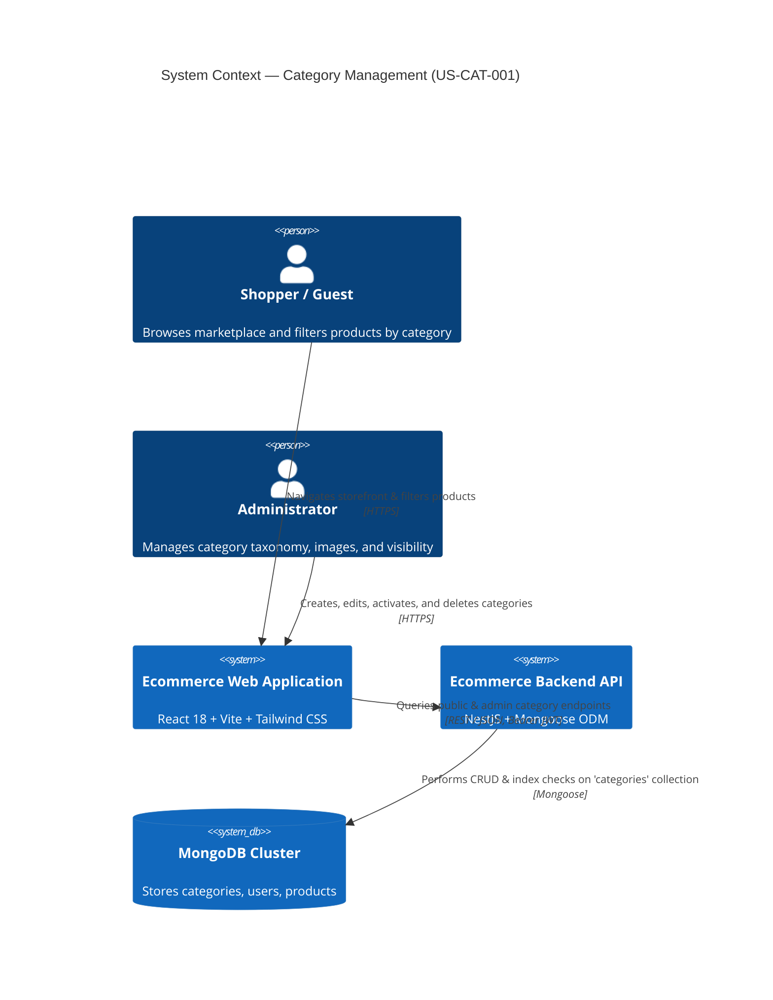
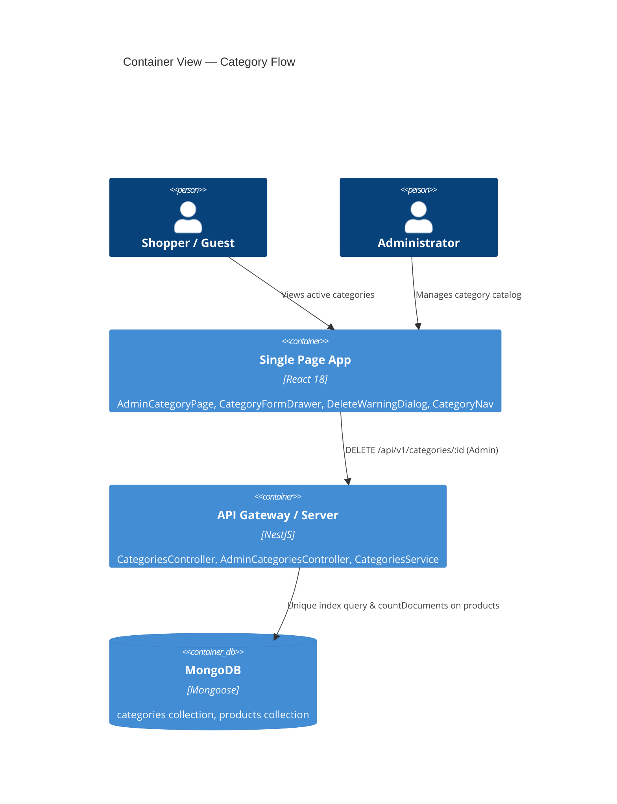
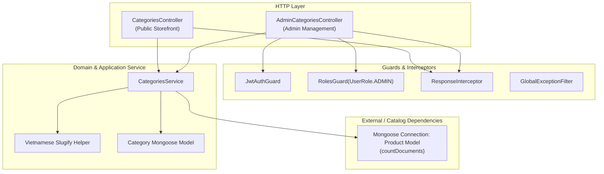
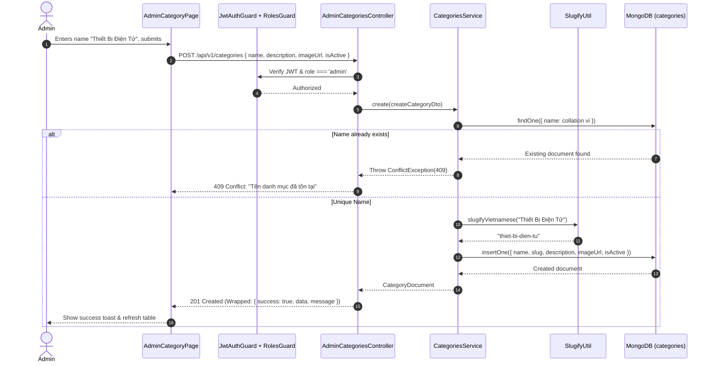
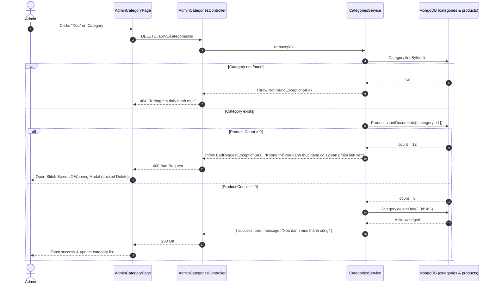

# Implementation Plan: Quản lý Category (Admin CRUD) — US-CAT-001

## 1. Technical Context & Baseline Alignment

| Aspect | Decision / Standard |
|---|---|
| **Feature ID** | `US-CAT-001` (`category-management`) |
| **Epic** | EPIC-02: Category & Product Catalog |
| **Target Branch** | `feat/category-management` |
| **Backend Framework** | NestJS 10 + `@nestjs/mongoose` (MongoDB) |
| **Frontend Framework** | React 18 + Vite + TypeScript + Tailwind CSS + shadcn/ui + Zustand + TanStack Query |
| **API Versioning** | `/api/v1/` prefix (Global prefix configured in `backend/src/main.ts`) |
| **Validation Layer** | `class-validator` + `class-transformer` on NestJS pipes; Formik + Yup on Frontend |
| **Response Format** | Wrapped in standard envelope: `{ success: true, data: T, message: string }` |
| **Error Format** | Handled by `GlobalExceptionFilter`: `{ success: false, message: string, errors?: string[] }` |
| **Design System** | `frontend/DESIGN.md` (Shopifi-inspired transactional light canvas `#fbfbf5`/`#ffffff`, pill buttons `rounded-full`, 1px hairlines) |
| **Stitch Screens** | Project `projects/6249429078653284294` (Screens: `920a53a9...` List, `4ff01870...` Delete Warning, `b3ff9a13...` Edit Form) |
| **Testing** | Jest for Unit/Integration; Playwright for End-to-End browser tests |

---

## 2. Constitution & Architecture Checklist

- [x] **Deep Module Design (Ousterhout):** `CategoriesModule` hides internal indexing, slug transliteration, and product-referential integrity checks behind a compact public API.
- [x] **Seam Discipline:** Public routes (`/api/v1/categories`) require no authentication. Administrative routes (`/api/v1/admin/categories`, mutations) enforce `JwtAuthGuard` + `RolesGuard(UserRole.ADMIN)`.
- [x] **Product Isolation / Loose Coupling:** `CategoriesService` checks product references safely using dynamic Mongoose connection models (`connection.models.Product`), adhering to `ASM-CAT-001-006` when the Product collection is not yet registered.
- [x] **Ponytail (Minimal Code):** Vietnamese transliteration uses a self-contained, dependency-free regex algorithm; standard Mongoose collation is utilized for case-insensitive uniqueness.
- [x] **Design Token Compliance:** 100% adherence to `frontend/DESIGN.md` — universal `rounded-full` pill buttons, `#c1fbd4` (Aloe-10) active badges, `#fbfbf5` canvas, and `ss03` font feature.
- [x] **Code Limits:** Every file < 300 lines; every function < 50 lines; zero TypeScript `any` types.

---

## 3. Architecture Diagrams

### 3.1 C4 Level 1 — System Context

### 3.2 C4 Level 2 — Container View

### 3.3 C4 Level 3 — Component View (`CategoriesModule`)

---

## 4. Module Boundary Map & Seams

### 4.1 Backend Module Boundaries

| Component | Path | Responsibility | Public Interface | Depends On |
|---|---|---|---|---|
| `CategoriesModule` | `backend/src/categories/categories.module.ts` | Configures Mongoose model, exports service, registers controllers | Module entrypoint | `MongooseModule`, `AuthModule` |
| `CategoriesController` | `backend/src/categories/categories.controller.ts` | Public storefront endpoints | `GET /api/v1/categories`, `GET /api/v1/categories/:slug` | `CategoriesService` |
| `AdminCategoriesController` | `backend/src/categories/admin-categories.controller.ts` | Administrative mutations and listing | `GET /api/v1/admin/categories`, `POST /api/v1/categories`, `PATCH /api/v1/categories/:id`, `DELETE /api/v1/categories/:id` | `CategoriesService`, `JwtAuthGuard`, `RolesGuard` |
| `CategoriesService` | `backend/src/categories/categories.service.ts` | Encapsulates CRUD, auto-slug transliteration, duplicate checks, product count queries | `findActive()`, `findAllAdmin()`, `create()`, `update()`, `remove()` | `CategoryModel`, `Connection` |
| `CategorySchema` | `backend/src/categories/schemas/category.schema.ts` | Schema definition with collation indexes | Mongoose Schema & `CategoryDocument` | `@nestjs/mongoose` |
| `SlugHelper` | `backend/src/categories/utils/slugify.util.ts` | Pure Vietnamese diacritic stripping and kebab-case conversion | `slugifyVietnamese(text: string): string` | Pure TypeScript (Stdlib) |
| `RolesGuard` | `backend/src/auth/guards/roles.guard.ts` | RBAC verification based on `@Roles(UserRole.ADMIN)` | NestJS `CanActivate` | `Reflector` |

### 4.2 Frontend Module Boundaries

| Component | Path | Responsibility | Depends On |
|---|---|---|---|
| `AdminCategoryPage` | `frontend/src/pages/AdminCategoryPage/index.tsx` | Admin management workspace matching Stitch Screen 1 | `useAdminCategories`, `AdminCategoryListTable`, `CategoryFormDrawer`, `DeleteWarningDialog` |
| `AdminCategoryListTable` | `frontend/src/pages/AdminCategoryPage/components/AdminCategoryListTable.tsx` | Data table with image avatar, name, slug, product count, status pill, action buttons | DESIGN.md tokens |
| `CategoryFormDrawer` | `frontend/src/pages/AdminCategoryPage/components/CategoryFormDrawer.tsx` | Slide-over drawer modal for creating and updating categories (Stitch Screen 3) | Formik + Yup, `useCreateCategory`, `useUpdateCategory` |
| `DeleteWarningDialog` | `frontend/src/pages/AdminCategoryPage/components/DeleteWarningDialog.tsx` | Delete protection modal warning when product count > 0 (Stitch Screen 2) | `useDeleteCategory`, `DialogConfirm` |
| `CategoryNav` | `frontend/src/components/CategoryNav/index.tsx` | Storefront horizontal category chips / dropdown for product discovery | `useCategories` |
| `category.service.ts` | `frontend/src/services/category.service.ts` | Axios client queries and mutations with TanStack Query hooks | `apiClient` |

---

## 5. Sequence Flows

### 5.1 Category Creation Flow (`POST /api/v1/categories`)

### 5.2 Category Deletion Protection Flow (`DELETE /api/v1/categories/:id`)

---

## 6. Implementation Phases & Milestones

### Phase 1: Foundation & RBAC Scaffolding
- **Goal:** Enable proper role-based authentication and category schema indexes.
- **Tasks:**
  - Implement `@Roles(UserRole.ADMIN)` decorator and `RolesGuard` in `backend/src/auth/guards/roles.guard.ts`.
  - Create `backend/src/categories/schemas/category.schema.ts` with compound collation indexes for Vietnamese case-insensitivity.
  - Implement `backend/src/categories/utils/slugify.util.ts` with comprehensive unit tests for all Vietnamese vowel accents and `đ/Đ`.

### Phase 2: Backend Core Services & Controllers
- **Goal:** Deliver fully validated REST endpoints matching contract `/api/v1/categories` and `/api/v1/admin/categories`.
- **Tasks:**
  - Build `CreateCategoryDto` and `UpdateCategoryDto` with `class-validator` rules (`name`, `description`, `imageUrl`, `isActive`).
  - Implement `CategoriesService` with:
    - `findActive()` (filtering `isActive: true` for public storefront).
    - `findAllAdmin()` (aggregation or countDocuments for `productCount`).
    - `create()` (slugification, 409 conflict checks).
    - `update()` (immutable slug enforcement, 409 conflict on duplicate rename).
    - `remove()` (cross-collection product count validation, BR-CAT-009 / BR-CAT-010).
  - Register `CategoriesController` (public) and `AdminCategoriesController` (admin-guarded).
  - Write unit tests for `CategoriesService` covering all acceptance scenarios.

### Phase 3: Frontend Service & TanStack Query Layer
- **Goal:** Provide typed HTTP hooks and state management for category operations.
- **Tasks:**
  - Define category TypeScript interfaces matching API contract in `frontend/src/interfaces/category.ts`.
  - Create `frontend/src/services/category.service.ts` using `apiClient`.
  - Implement TanStack Query hooks: `useCategories`, `useAdminCategories`, `useCreateCategory`, `useUpdateCategory`, `useDeleteCategory`.

### Phase 4: Frontend UI Components (Stitch Screen Fidelity)
- **Goal:** Build pixel-perfect UI according to Stitch screens and `frontend/DESIGN.md`.
- **Tasks:**
  - Implement `AdminCategoryPage` and `AdminCategoryListTable` matching Stitch Screen `920a53a998bd4e8e8b0b16ec16a08793`:
    - Pill button `+ Thêm danh mục` (`bg-primary text-on-primary rounded-full`).
    - Search input & status filter chips (`Tất cả`, `Hoạt động` `#c1fbd4`, `Đang ẩn` `#d4d4d8`).
    - Category row with thumbnail preview, slug font mono, product count, status badge, action buttons.
  - Implement `CategoryFormDrawer` matching Stitch Screen `b3ff9a13af8b42c7b154bc1730ab9471`:
    - Slide-over drawer with backdrop blur.
    - Fields: Name, readonly slug with lock icon, Description, Image URL with preview, Active toggle switch.
  - Implement `DeleteWarningDialog` matching Stitch Screen `4ff01870d2a9498b8f48f72196b0383c`:
    - Red alert container for product count > 0 with instruction to reassign products or hide category.
    - Standard confirmation for zero product count categories.
  - Implement `CategoryNav` storefront navigation bar component.

### Phase 5: Verification & End-to-End Testing
- **Goal:** Comprehensive validation across functional, a11y, and design requirements.
- **Tasks:**
  - Run backend unit tests (`pnpm test categories`).
  - Run frontend component unit tests.
  - Execute Playwright E2E tests:
    - Guest navigates storefront and sees only active categories.
    - Admin creates new category with auto-slug and verified Vietnamese characters.
    - Admin encounters 409 conflict when naming collisions occur.
    - Admin updates category and verifies slug remains unchanged.
    - Admin deletes empty category successfully.
    - Admin is blocked from deleting category with active products (verifying 400 error message and Stitch Screen 2 modal).
  - Perform WCAG 2.1 AA keyboard navigation and contrast check.

---

## 7. Risks & Mitigations

| Risk | Probability | Impact | Mitigation Strategy |
|---|---|---|---|
| **R-CAT-01: Race condition on category name creation** | Low | Medium | MongoDB unique index on `name` with collation `vi` handles concurrent writes; backend catches duplicate key error (code 11000) and transforms it into HTTP 409 Conflict. |
| **R-CAT-02: Product model not registered yet in Sprint 1** | High | Low | Dynamic model check `this.connection.models.Product` ensures graceful return of 0 products without throwing schema missing exceptions (`ASM-CAT-001-006`). |
| **R-CAT-03: Vietnamese diacritics slug collisions** | Low | Low | Normalization via `NFD` and `[\u0300-\u036f]` regex reliably flattens Vietnamese characters (`đ` -> `d`, `ê` -> `e`, etc.). Unique index on `slug` guarantees uniqueness. |
| **R-CAT-04: Accidental modification of slug on PATCH** | Low | High | `UpdateCategoryDto` explicitly omits `slug`; `CategoriesService.update()` explicitly strips `slug` from any update payload. |
| **R-CAT-05: Non-Admin access to administrative mutations** | Low | High | `AdminCategoriesController` is decorated with `@UseGuards(JwtAuthGuard, RolesGuard)` and `@Roles(UserRole.ADMIN)`. |

---

## 8. Definition of Done (DoD)

- [ ] All 5 REST endpoints implemented and verified with versioned `/api/v1/` routes.
- [ ] 100% compliant with `frontend/DESIGN.md` (Pill buttons `rounded-full`, `#fbfbf5` canvas, 1px hairlines).
- [ ] Pixel fidelity verified against Stitch screens `920a53a9...`, `4ff01870...`, `b3ff9a13...`.
- [ ] Zero TypeScript `any` types in both backend and frontend.
- [ ] All files under 300 lines; all functions under 50 lines.
- [ ] Complete unit test coverage for `CategoriesService`, `slugifyUtil`, and frontend modals.
- [ ] E2E Playwright test passing for all 4 User Stories in `user-stories.md`.
