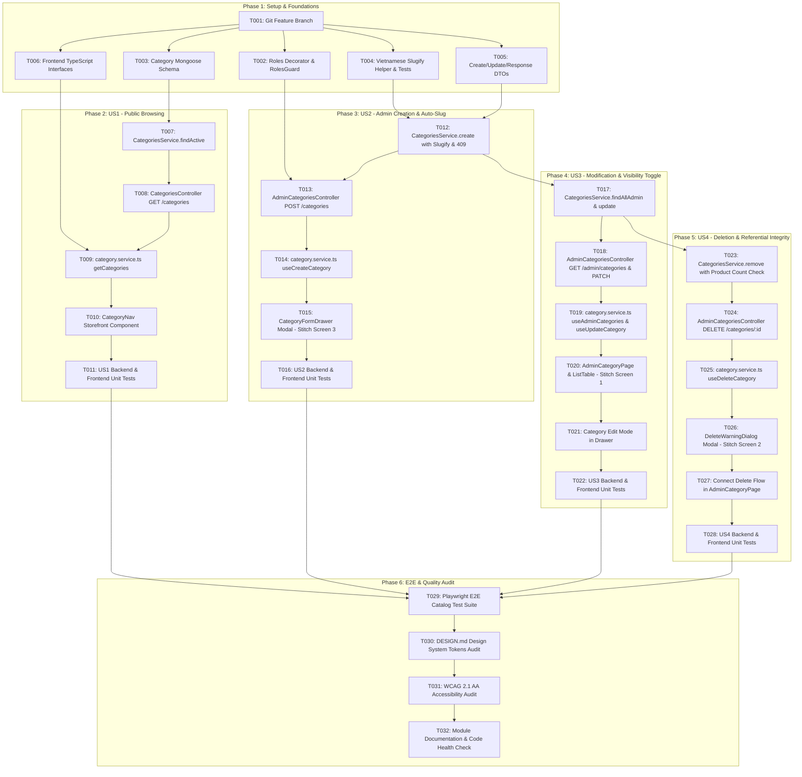

# Tasks: Category Management (US-CAT-001)

**Feature**: `category-management`  
**Generated from**: `baseline.md`, `spec.md`, `user-stories.md`, `data-model.md`, `contracts/api.yaml`  
**Total Tasks**: 32  

---

## Task Dependency Overview

---

## Phase 1: Setup & Foundational Prerequisites

- [x] **T001** [P] Initialize feature branch `feat/category-management` and verify dependencies.
  - **Path**: Monorepo root
  - **Action**: Check `package.json` in both `backend` and `frontend`. Ensure `class-validator`, `class-transformer`, `@nestjs/mongoose`, and `@tanstack/react-query` are installed.

- [x] **T002** [P] Implement `Roles` decorator and `RolesGuard` in `backend/src/auth/guards/roles.guard.ts`.
  - **Prerequisites**: Existing `backend/src/users/schemas/user.schema.ts` (`UserRole.ADMIN`).
  - **Details**: Implement custom decorator `@Roles(...roles: UserRole[])` and NestJS guard verifying `user.role === UserRole.ADMIN`. Throw `ForbiddenException` on role mismatch.

- [x] **T003** [P] Create `Category` Mongoose schema in `backend/src/categories/schemas/category.schema.ts`.
  - **Details**: Fields: `name` (required, trimmed, 2-50 chars), `slug` (required, lowercase, trimmed), `description` (optional, max 500 chars), `imageUrl` (optional, string), `isActive` (boolean, default true).
  - **Indexes**: Compound collation unique index on `{ name: 1 }` (`locale: 'vi', strength: 2`), unique index on `{ slug: 1 }`, and index on `{ isActive: 1 }`.

- [x] **T004** [P] Implement Vietnamese slug transliteration helper & unit tests in `backend/src/categories/utils/slugify.util.ts`.
  - **Algorithm**: Standard NFD normalization, removal of combining diacritical marks (`[\u0300-\u036f]`), replacement of `đ/Đ` with `d`, replacement of non-alphanumeric chars with `-`, trim hyphens, convert to lower case.
  - **Test File**: `backend/src/categories/utils/__tests__/slugify.util.spec.ts`. Must cover accents: `á, à, ả, ã, ạ, ă, ắ, ằ, ẳ, ẵ, ặ, â, ấ, ầ, ẩ, ẫ, ậ, đ, Đ, ê, ế, ô, ố, ơ, ư, ý...`.

- [x] **T005** [P] Create backend DTOs in `backend/src/categories/dto/`.
  - `create-category.dto.ts`: `@IsString()`, `@IsNotEmpty()`, `@MinLength(2)`, `@MaxLength(50)`, `@IsOptional()`, `@MaxLength(500)`, `@IsUrl()`, `@IsBoolean()`.
  - `update-category.dto.ts`: All fields optional, strictly omitting `slug`.
  - `category-response.dto.ts`: Standard response shapes matching contracts.

- [x] **T006** [P] Create frontend TypeScript interfaces in `frontend/src/interfaces/category.ts`.
  - **Details**: Define `CategoryItem`, `AdminCategoryItem`, `CreateCategoryPayload`, `UpdateCategoryPayload`, and response envelopes matching `contracts/category.contract.ts`.

---

## Phase 2: User Story 1 — Public Category Browsing (Priority: P1)

**Goal**: Storefront visitors browse active categories for product navigation.

- [x] **T007** [US1] Implement `CategoriesService.findActive()` in `backend/src/categories/categories.service.ts`.
  - **Details**: Query `this.categoryModel.find({ isActive: true }).sort({ name: 1 }).lean().exec()`.
  - **Isolation**: Inactive categories (`isActive: false`) must never be returned.

- [x] **T008** [US1] Implement `CategoriesController` in `backend/src/categories/categories.controller.ts`.
  - **Routes**:
    - `GET /api/v1/categories`: Public, calls `CategoriesService.findActive()`.
    - `GET /api/v1/categories/:slug`: Public, calls `CategoriesService.findBySlug(slug)`.
  - **Auth**: No guards required (Guest access).

- [x] **T009** [US1] Create frontend API service functions in `frontend/src/services/category.service.ts`.
  - **Details**: `getCategories()`, `getCategoryBySlug(slug)` via `apiClient`.
  - **Hooks**: `useCategories()`, TanStack Query key `['categories', 'public']`.

- [x] **T010** [US1] Build `CategoryNav` storefront component in `frontend/src/components/CategoryNav/index.tsx`.
  - **Design Specs**: Horizontal scrolling pills on mobile/desktop, active category pill styling (`bg-[#c1fbd4] text-primary rounded-full`).
  - **Empty State**: Renders gracefully with zero items if empty array is returned.

- [x] **T011** [US1] Unit tests for US1 in `backend/src/categories/__tests__/categories.service.spec.ts` & `frontend`.
  - Verify active categories returned; inactive categories filtered out.
  - Verify empty state returns `[]` with status 200 OK.

---

## Phase 3: User Story 2 — Admin Category Creation & Auto-Slug (Priority: P1)

**Goal**: Administrators create new categories with auto-generated immutable slug and 409 conflict detection.

- [x] **T012** [US2] Implement `CategoriesService.create()` in `backend/src/categories/categories.service.ts`.
  - **Collision Check**: Query existing document with collation `{ locale: 'vi', strength: 2 }`.
  - **Conflict Response**: If name exists, throw `ConflictException('Tên danh mục đã tồn tại')` (BR-CAT-002).
  - **Slug Generation**: Compute slug via `slugifyVietnamese(dto.name)` (BR-CAT-003). Check slug uniqueness or append `-1` if collision occurs.
  - **Persistence**: Save category with `isActive: dto.isActive ?? true`.

- [x] **T013** [US2] Implement `AdminCategoriesController.create()` in `backend/src/categories/admin-categories.controller.ts`.
  - **Route**: `POST /api/v1/categories`.
  - **Guards**: `@UseGuards(JwtAuthGuard, RolesGuard)`, `@Roles(UserRole.ADMIN)` (BR-CAT-001).
  - **Response**: 201 Created with created Category document.

- [x] **T014** [US2] Implement `useCreateCategory()` mutation hook in `frontend/src/services/category.service.ts`.
  - **Details**: Invalidate query keys `['categories', 'admin']` and `['categories', 'public']` upon success.
  - **Error Handling**: Toast notification on 409 Conflict ("Tên danh mục đã tồn tại") and 400 Bad Request.

- [x] **T015** [US2] Build `CategoryFormDrawer` modal matching Stitch Screen 3 (`b3ff9a13af8b42c7b154bc1730ab9471`).
  - **Path**: `frontend/src/pages/AdminCategoryPage/components/CategoryFormDrawer.tsx`.
  - **Drawer UI**: Right slide-over panel with 480px width, backdrop blur, close button.
  - **Form Fields**:
    - Tên danh mục: Text input with live auto-slug preview.
    - Đường dẫn (slug): Readonly input displaying `/category/{slug}` with lock icon (`cursor-not-allowed`).
    - Mô tả danh mục: Textarea with max 500 characters helper copy.
    - Ảnh danh mục: URL input with live image preview and reset button.
    - Kích hoạt danh mục: Switch toggle component (`checked` by default).
  - **Buttons**: Universal pill buttons (`rounded-full`), `button-primary-pill` ("Tạo danh mục" / "Lưu thay đổi").

- [x] **T016** [US2] Unit tests for US2 in `backend/src/categories/__tests__/categories.service.spec.ts`.
  - Test slug transliteration integration (e.g., "Thiết Bị Điện Tử" -> "thiet-bi-dien-tu").
  - Test case-insensitive duplicate name conflict throws HTTP 409.
  - Test DTO validation rejects invalid inputs (name < 2 chars, invalid image URL).

---

## Phase 4: User Story 3 — Admin Category Modification & Visibility Toggle (Priority: P1)

**Goal**: Administrators update category details and toggle visibility while preserving immutable slugs.

- [x] **T017** [US3] Implement `CategoriesService.findAllAdmin()` and `update()` in `backend/src/categories/categories.service.ts`.
  - `findAllAdmin()`: Query all categories; lookup product counts via Mongoose connection (`Product.countDocuments({ category: id })`) returning `productCount: number`.
  - `update(id, dto)`:
    - Verify category exists; throw 404 if not found.
    - If `dto.name` changed, check collation collision excluding current `id`. Throw 409 if duplicate.
    - Explicitly ignore or delete `slug` from update payload to guarantee immutability (BR-CAT-004).
    - Update fields: `name`, `description`, `imageUrl`, `isActive`.

- [x] **T018** [US3] Implement `AdminCategoriesController.findAll()` and `update()` in `backend/src/categories/admin-categories.controller.ts`.
  - `GET /api/v1/admin/categories`: Bearer JWT + Admin role. Returns all categories with `productCount`.
  - `PATCH /api/v1/categories/:id`: Bearer JWT + Admin role. Updates category document.

- [x] **T019** [US3] Implement `useAdminCategories()` and `useUpdateCategory()` hooks in `frontend/src/services/category.service.ts`.
  - **Query Key**: `['categories', 'admin']`.
  - **Optimistic Updates**: Immediate toggle feedback for `isActive` switch.

- [x] **T020** [US3] Build `AdminCategoryPage` & `AdminCategoryListTable` matching Stitch Screen 1 (`920a53a998bd4e8e8b0b16ec16a08793`).
  - **Path**: `frontend/src/pages/AdminCategoryPage/index.tsx` & `AdminCategoryListTable.tsx`.
  - **Header**: Title "Danh mục" (font weight 330, Neue Haas Grotesk), subtitle, "+ Thêm danh mục" pill button.
  - **Search & Filter Bar**:
    - Search input with search icon.
    - Filter pills: "Tất cả", "Hoạt động" (`bg-[#c1fbd4] text-[#1a5034]`), "Đang ẩn" (`bg-[#d4d4d8] text-[#3f3f46]`).
  - **Table Columns**:
    - Thumbnail image (12x12 rounded-lg with hairline border).
    - Tên danh mục (font-medium text-primary).
    - Đường dẫn (slug, font-mono text-[13px] text-shade-50).
    - Số sản phẩm ("X sản phẩm").
    - Trạng thái: Pill badge (`Hoạt động` - `bg-[#c1fbd4]` vs `Đang ẩn` - `bg-shade-30`).
    - Thao tác: "Chỉnh sửa" pill button and "Xóa" outline pill button (`text-error hover:border-error`).

- [x] **T021** [US3] Wire Edit Category action to open `CategoryFormDrawer` with existing category values.
  - Populate name, readonly slug, description, imageUrl, and isActive switch.
  - Submit updates via `useUpdateCategory`.

- [x] **T022** [US3] Unit tests for US3 in `backend` and `frontend`.
  - Verify `PATCH` does not modify `slug` even if `slug` is sent in body.
  - Verify duplicate rename throws 409 Conflict.
  - Verify toggling `isActive: false` removes item from public list but keeps it in admin list.

---

## Phase 5: User Story 4 — Admin Category Deletion & Referential Integrity (Priority: P1)

**Goal**: Administrators delete unused categories while strictly preventing deletion of categories associated with products.

- [x] **T023** [US4] Implement `CategoriesService.remove(id)` in `backend/src/categories/categories.service.ts`.
  - Validate category exists; throw `NotFoundException('Không tìm thấy danh mục')` if not found.
  - Query `Product` collection: `Product.countDocuments({ $or: [{ category: id }, { categoryId: id }] })`.
  - If count > 0: throw `BadRequestException('Không thể xóa danh mục đang có ${count} sản phẩm liên kết')` (BR-CAT-009, BR-CAT-010).
  - If count === 0: execute `Category.deleteOne({ _id: id })` and return `{ success: true, message: 'Xóa danh mục thành công' }`.

- [x] **T024** [US4] Implement `AdminCategoriesController.remove()` in `backend/src/categories/admin-categories.controller.ts`.
  - **Route**: `DELETE /api/v1/categories/:id`.
  - **Guards**: `@UseGuards(JwtAuthGuard, RolesGuard)`, `@Roles(UserRole.ADMIN)`.

- [x] **T025** [US4] Implement `useDeleteCategory()` mutation hook in `frontend/src/services/category.service.ts`.
  - Handles 400 Bad Request error by triggering the Stitch Screen 2 Warning Modal.
  - Invalidate `['categories', 'admin']` and `['categories', 'public']` on successful deletion.

- [x] **T026** [US4] Build `DeleteWarningDialog` matching Stitch Screen 2 (`4ff01870d2a9498b8f48f72196b0383c`).
  - **Path**: `frontend/src/pages/AdminCategoryPage/components/DeleteWarningDialog.tsx`.
  - **Mode 1 (Blocked, productCount > 0)**:
    - Red alert container (`bg-red-50/50 border border-red-200`).
    - Warning icon, headline "Không thể xóa danh mục".
    - Message: "Không thể xóa danh mục này vì hiện có {count} sản phẩm đang sử dụng danh mục."
    - Instruction: "Vui lòng chuyển hoặc gán lại toàn bộ {count} sản phẩm sang danh mục khác trước khi thực hiện xóa."
    - Card previewing category and product count badge.
    - Single action button: "Đóng" pill button (`bg-primary text-on-primary rounded-full`).
  - **Mode 2 (Permitted, productCount === 0)**:
    - Confirmation alert: "Bạn có chắc chắn muốn xóa danh mục {name}? Hành động này không thể hoàn tác."
    - Action buttons: "Hủy" outline pill and "Xóa vĩnh viễn" destructive pill button.

- [x] **T027** [US4] Connect delete triggers from `AdminCategoryListTable` rows to `DeleteWarningDialog`.
  - If `category.productCount > 0`, open Blocked Warning Dialog immediately.
  - If `category.productCount === 0`, open Confirmation Dialog and execute deletion on confirm.

- [x] **T028** [US4] Unit tests for US4 in `backend/src/categories/__tests__/categories.service.spec.ts`.
  - Verify deletion of category with 5 products throws 400 with localized message.
  - Verify deletion of category with 0 products succeeds and purges record.
  - Verify deletion of non-existent category returns 404 Not Found.

---

## Phase 6: End-to-End Integration, DESIGN.md Audit & Verification

- [x] **T029** Playwright E2E Test Suite in `frontend/e2e/category-management.spec.ts`.
  - **Scenario 1**: Guest browses storefront navigation, verifies only active categories appear.
  - **Scenario 2**: Admin logs in, opens Category Management page, clicks "+ Thêm danh mục", creates category, verifies table updates and slug matches Vietnamese transliteration.
  - **Scenario 3**: Admin attempts duplicate category name creation, verifies 409 Conflict toast appears.
  - **Scenario 4**: Admin edits category name and toggles `isActive: false`, verifies slug is unchanged and public nav no longer shows it.
  - **Scenario 5**: Admin clicks delete on category with linked products, verifies Stitch Screen 2 warning dialog appears with exact product count and delete button is blocked.
  - **Scenario 6**: Admin deletes empty category, verifies success toast and removal from table.

- [x] **T030** Design System & Token Audit (`frontend/DESIGN.md`).
  - Verify all buttons utilize `rounded-full` class (zero rounded-rectangle buttons).
  - Verify transactional canvas colors (`bg-canvas-cream` / `#fbfbf5`, `bg-canvas-light` / `#ffffff`).
  - Verify active badges use `#c1fbd4` (Aloe-10) with `#1a5034` text.
  - Verify typography applies OpenType `ss03` stylistic set and display font weights (330 thin).
  - Verify 1px hairlines (`border-[#e4e4e7]`).

- [x] **T031** Accessibility (WCAG 2.1 AA) & Keyboard Navigation Check.
  - Form labels paired with inputs via `htmlFor` / `id`.
  - Drawer and dialog focus trap and Escape key dismissal.
  - ARIA attributes: `aria-modal="true"`, `role="dialog"`, `aria-labelledby`.
  - Minimum touch targets: >= 44x44px for buttons and form controls.

- [x] **T032** Code Health & Documentation Check.
  - Verify all files are < 300 lines and functions < 50 lines.
  - Run TypeScript compile check (`tsc --noEmit`) in both packages with zero `any` types.
  - Run linting in `backend` and `frontend`.
