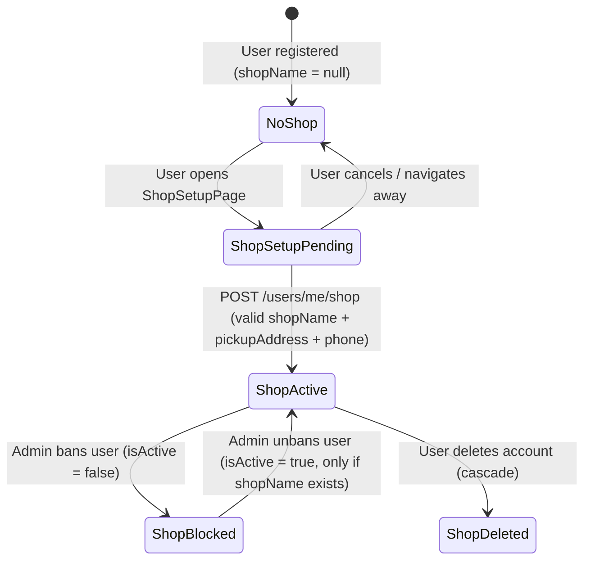

# Domain Model: Profile & Thiết lập gian hàng (US-SELL-001)

## 1. RBAC Matrix

| Resource / Action                | Guest   | Customer (Buyer) | Customer (Seller) | Admin   |
|----------------------------------|---------|------------------|-------------------|---------|
| `GET /users/me`                  | ❌ 401  | ✅ own            | ✅ own             | ✅ any  |
| `PATCH /users/me`                | ❌ 401  | ✅ own            | ✅ own             | ❌ 403  |
| `PATCH /users/me/shop`           | ❌ 401  | ✅ own            | ✅ own             | ❌ 403  |
| `GET /shops/:sellerId`           | ✅ public| ✅ public        | ✅ public          | ✅ any  |

**Ownership rules:**
- User can only access/modify their own profile and shop
- Admin can view any user/profile but cannot modify shop setup (only ban/unban user which cascades to shop)
- Public shop view (`/shops/:sellerId`) is accessible to all (including Guest)

## 2. State Machine — Shop Setup Lifecycle



**States:**
- `NoShop`: User has no `shopName` — cannot list products
- `ShopSetupPending`: User is on setup page, entering data
- `ShopActive`: `shopName` + `pickupAddress` + `phone` set; `shopSlug` generated; can list products
- `ShopBlocked`: User banned (`isActive = false`); shop hidden from public; seller sees blocked status
- `ShopDeleted`: User account deleted

**Transitions:**
- `NoShop → ShopSetupPending`: User clicks "Đăng bán" or navigates to `/shop/setup`
- `ShopSetupPending → ShopActive`: Valid submission (shopName 3–50, pickupAddress ≥10, phone VN format)
- `ShopSetupPending → NoShop`: Cancel/abandon
- `ShopActive → ShopBlocked`: Admin PATCH `/admin/users/:id/ban`
- `ShopBlocked → ShopActive`: Admin PATCH `/admin/users/:id/unban` (only if shopName exists)
- `ShopActive/ShopBlocked → ShopDeleted`: Account deletion

## 3. Business Rules (BR-)

**BR-SELL-001**: `shopName` length must be 3–50 characters. Validation: `string().min(3).max(50).trim()`.

**BR-SELL-002**: `shopSlug` auto-generated from `shopName`:
- Lowercase, replace spaces/special chars with `-`, trim multiple `-`
- Append `-<n>` if collision (e.g., "my-shop" → "my-shop-2")
- Stable once created; can be changed via `PATCH /users/me/shop` with availability check

**BR-SELL-003**: `pickupAddress` free text, minimum 10 characters. Validation: `string().min(10).trim()`.

**BR-SELL-004**: `phone` required, VN mobile format: `^(\+84|0)[0-9]{9,10}$`. Stored on User profile (`users.phone`).

**BR-SELL-005**: Shop setup requires all three fields (`shopName`, `pickupAddress`, `phone`) in single request. Partial updates not allowed for initial setup.

**BR-SELL-006**: Public shop view (`GET /shops/:sellerId`) returns 404 if:
- User has no `shopName` (NoShop state)
- User `isActive = false` (banned)

**BR-SELL-007**: `productCount` in public shop view = count of products where `sellerId = :sellerId` AND `isActive = true` AND `isBlocked = false`.

**BR-SELL-008**: One shop per user (1:1 User:Shop). `shopName`/`shopSlug`/`pickupAddress` stored as sub-document on `users` collection.

**BR-SELL-009**: `joinedAt` = timestamp when `shopName` first set (shop activation). Immutable.

**BR-SELL-010**: If user banned (`isActive = false`): cannot login (403), shop hidden from public, all products soft-blocked (`blockReason = seller_banned`), seller retains access to own data.

**Anti-abuse**: Shop slug collision resolution prevents squatting. Rate-limit shop setup changes (max 5/day per user) to prevent slug cycling.

## 4. Workflows & Edge Cases

### Happy Path: Shop Setup
1. User registers/logs in (`US-AUTH-001`)
2. User clicks "Đăng bán" → FE checks `shopName` null → redirects to `/shop/setup`
3. User fills `shopName`, `pickupAddress`, `phone`
4. User submits → BE validates BR-SELL-001 through BR-SELL-004
5. BE generates `shopSlug` (BR-SELL-002), sets `joinedAt`, saves to `users` document
6. BE returns 200 with updated profile + shop
7. FE redirects to `/products/create` (US-PRD-001)

### Edge Cases
| Scenario | Resolution |
|----------|------------|
| Duplicate `shopSlug` collision | Auto-append `-2`, `-3`, etc. (BR-SELL-002) |
| User submits invalid phone format | 400 with field-specific error (BR-SELL-004) |
| User submits shopName < 3 or > 50 chars | 400 with field-specific error (BR-SELL-001) |
| User abandons setup mid-form | State remains `NoShop`; data not persisted |
| Banned user tries to access `/users/me` | 403 "Tài khoản đã bị khóa" (existing BR-AUTH-011) |
| Banned user's public shop accessed | 404 (BR-SELL-006) |
| Admin unbans user who had shop | Shop restored to `ShopActive`; products unblocked if `blockReason = seller_banned` |
| Concurrent shop setup requests | Optimistic concurrency via `version` field on User doc; retry with 409 |
| User changes `shopName` after setup | Allowed; `shopSlug` can optionally change (with availability check) |

## 5. Entities & ERD

```mermaid
erDiagram
    User ||--|| Shop : has
    User {
        ObjectId _id
        string email UK
        string passwordHash
        string fullName
        string phone
        string address
        enum role [customer, admin]
        bool isActive
        string refreshTokenHash
        int version
        Shop shop
        DateTime createdAt
        DateTime updatedAt
    }
    Shop {
        string shopName
        string shopSlug UK
        string pickupAddress
        DateTime joinedAt
        int productCount (computed)
    }
```

**Deletion policy:**
- User deletion: hard delete (cascade: products → soft delete `isActive=false`, orders preserved for history)
- Shop "deletion": not supported separately; only via user account deletion

**Retention:** User data retained indefinitely unless deletion requested (GDPR-compliant).

## 6. UX States & NFRs

### UX States
| Screen | Empty | Loading | Error | Success/Feedback |
|--------|-------|---------|-------|------------------|
| ProfilePage | N/A | Skeleton | Inline field errors | Toast "Đã cập nhật" |
| ShopSetupPage | N/A | Spinner on submit | Inline field errors (shopName, pickupAddress, phone) | Redirect to `/products/create` + toast "Gian hàng đã sẵn sàng" |
| Public Shop (`/shops/:slug`) | "Chưa có sản phẩm" | Skeleton grid | 404 page | N/A |

### Non-Functional Requirements
- **Performance**: P95 < 200ms for `GET /users/me`, `GET /shops/:sellerId`
- **Security**: All mutations require valid JWT; input sanitization on all fields; `shopSlug` uniqueness at DB index level
- **i18n**: Vietnamese only (per Won't-Have)
- **Accessibility**: WCAG 2.1 AA — semantic HTML, label/input pairing, focus management, ARIA live regions for validation errors
- **Observability**: Log shop setup completion (userId, shopSlug); log public shop 404s for monitoring

## 7. CONTEXT.md Updates

See updated entries in `CONTEXT.md`:
- `shopSlug`
- `pickupAddress`
- `VN phone format`