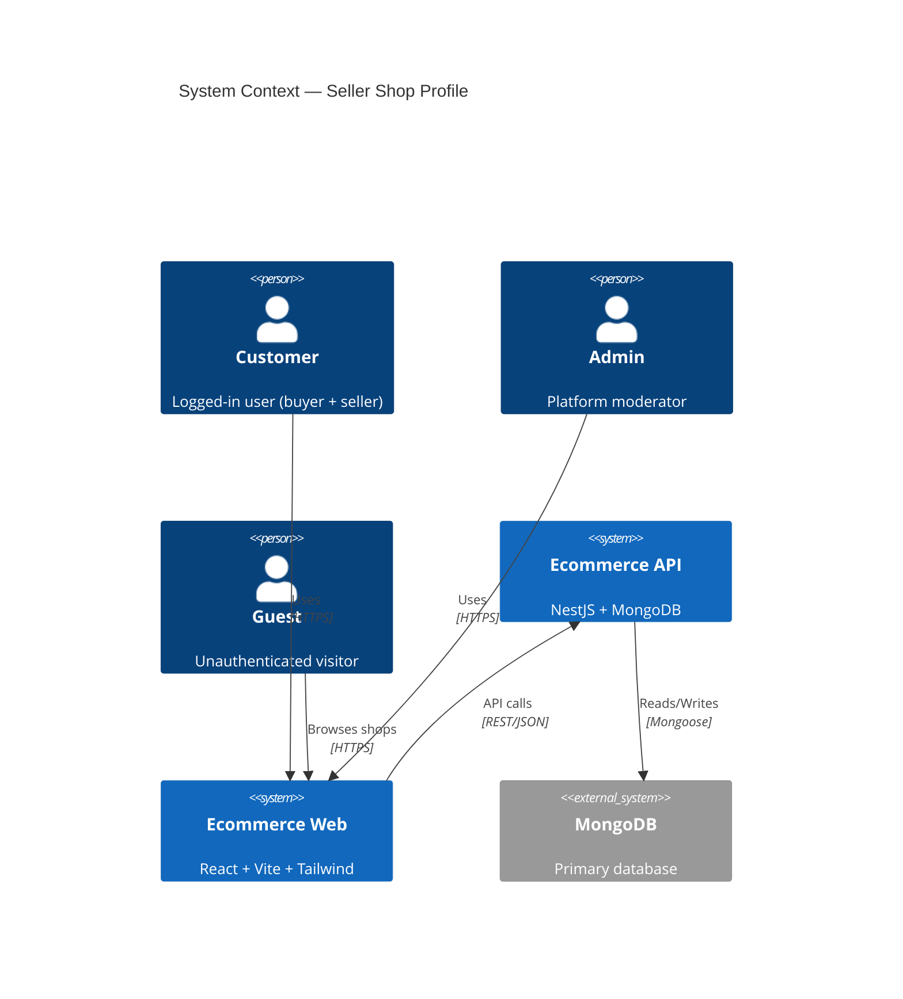
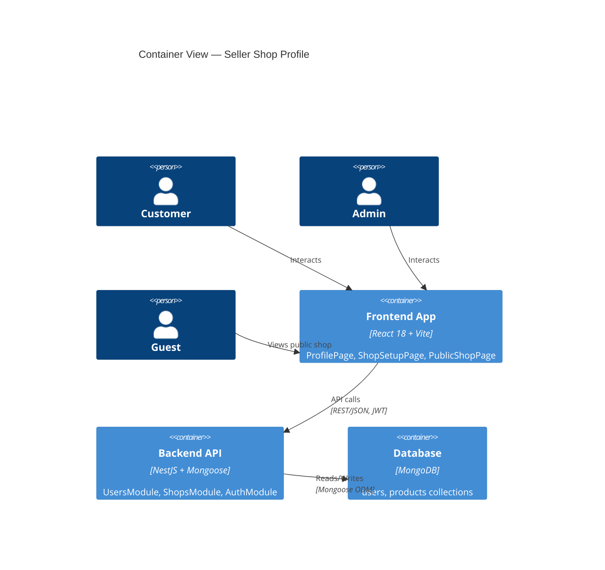

# Implementation Plan: Seller Shop Profile

## Technical Context

| Aspect | Decision |
|--------|----------|
| Language | TypeScript |
| Backend | NestJS + Mongoose ODM |
| Frontend | React 18 + Vite + TypeScript + Tailwind CSS + shadcn/ui + Zustand + TanStack Query + React Router v6 + Axios + Formik/Yup |
| Database | MongoDB |
| Infrastructure | Local dev (MongoDB local / Atlas) + Cloudinary + VNPay Sandbox |
| Testing | Jest (unit) + Playwright (E2E) |
| API Versioning | `/api/v1/` |

---

## Constitution Check

- [ ] Deep modules (Ousterhout) — public interfaces minimal, hide implementation
- [ ] Seam discipline — testable boundaries, no cross-imports
- [ ] Leverage & locality — shared types in contracts, no duplication
- [ ] Ponytail (minimal code) — stdlib > custom, native > dep, one-line > abstraction
- [ ] Design system compliance — DESIGN.md tokens, Stitch MCP screens

---

## Architecture Diagrams

### C4 Level 1 — System Context



### C4 Level 2 — Container View



---

## Module Boundary Map

| Module | Responsibility | Public Interface | Depends On |
|--------|----------------|------------------|------------|
| `UsersModule` | User profile CRUD, shop setup, auth integration | `UsersController`, `UsersService` | `AuthModule`, `ShopsModule` |
| `ShopsModule` | Public shop view, productCount query | `ShopsController`, `ShopsService` | `UsersModule` (read-only), `ProductsModule` |
| `AuthModule` | JWT guards, strategies, token management | `JwtAuthGuard`, `OptionalJwtAuthGuard` | — |
| `ProductsModule` (existing) | Product queries for shop productCount | `ProductsService.findForShopCount()` | — |
| `AdminModule` (existing) | User ban/unban with cascade | `AdminUsersController` | `UsersModule`, `ProductsModule` |

### Frontend Modules

| Module | Responsibility | Public Interface | Depends On |
|--------|----------------|------------------|------------|
| `ProfilePage` | Display/edit user profile | `/profile` route | `userService`, `authStore` |
| `ShopSetupPage` | Shop setup form | `/shop/setup` route | `userService`, `shopService` |
| `PublicShopPage` | Public shop view | `/shops/:sellerId` route | `shopService` |
| `userService` | API calls for profile/shop | `getProfile()`, `updateProfile()`, `setupShop()` | `apiClient` |
| `shopService` | API calls for public shop | `getPublicShop(sellerId)` | `apiClient` |

---

## Component Architecture

### Backend

```
src/
├── users/
│   ├── users.controller.ts      # GET /users/me, PATCH /users/me, PATCH /users/me/shop
│   ├── users.service.ts         # Profile logic, shop setup, slug generation
│   ├── dto/
│   │   ├── get-profile.dto.ts
│   │   ├── update-profile.dto.ts
│   │   └── setup-shop.dto.ts
│   ├── schemas/
│   │   ├── user.schema.ts       # Extended with Shop sub-document
│   │   └── shop.schema.ts       # Sub-document definition
│   └── users.module.ts
├── shops/
│   ├── shops.controller.ts      # GET /shops/:sellerId
│   ├── shops.service.ts         # Public shop query, productCount
│   └── shops.module.ts
├── admin/
│   └── admin-users.controller.ts # PATCH /admin/users/:id/ban|unban (cascade)
└── common/
    ├── guards/
    │   ├── jwt-auth.guard.ts
    │   └── optional-jwt-auth.guard.ts
    └── interceptors/
        └── response.interceptor.ts
```

### Frontend

```
src/
├── pages/
│   ├── ProfilePage.tsx
│   ├── ShopSetupPage.tsx
│   └── PublicShopPage.tsx
├── services/
│   ├── user.service.ts
│   └── shop.service.ts
├── stores/
│   └── auth.store.ts
├── components/
│   ├── ProfileForm.tsx
│   ├── ShopSetupForm.tsx
│   └── PublicShopCard.tsx
└── hooks/
    └── useShopSlug.ts (if needed)
```

---

## Database Changes

### Migration: Add Shop Sub-document to Users

```javascript
// No migration needed — sub-document is optional
// MongoDB schema validation handles new fields
// Unique sparse index on shop.shopSlug
```

**Mongoose Schema Updates**:
```typescript
// user.schema.ts
const ShopSchema = new Schema({
  shopName: { type: String, required: true, minlength: 3, maxlength: 50, trim: true },
  shopSlug: { type: String, required: true, unique: true, sparse: true, match: /^[a-z0-9-]+$/ },
  pickupAddress: { type: String, required: true, minlength: 10, trim: true },
  joinedAt: { type: Date, immutable: true }
}, { _id: false });

const UserSchema = new Schema({
  // ... existing fields
  shop: { type: ShopSchema, default: null },
  version: { type: Number, default: 0 }
});
```

---

## API Contracts

See `contracts/api.yaml` (OpenAPI 3.0.3)

### Endpoints Summary

| Method | Path | Auth | Description |
|--------|------|------|-------------|
| GET | `/users/me` | JWT | Get profile + shop |
| PATCH | `/users/me` | JWT | Update profile |
| PATCH | `/users/me/shop` | JWT | Setup/update shop |
| GET | `/shops/:sellerId` | None | Public shop view |

---

## Implementation Phases

### Phase 1: Backend Core (Parallel)
- [ ] **T1**: Extend User schema with Shop sub-document + unique sparse index on `shop.shopSlug`
- [ ] **T2**: Implement `UsersService` — `getProfile()`, `updateProfile()`, `setupShop()` with slug generation + optimistic locking
- [ ] **T3**: Implement `UsersController` — 3 endpoints with DTO validation (class-validator)
- [ ] **T4**: Implement `ShopsService` — `getPublicShop(sellerId)` with productCount query
- [ ] **T5**: Implement `ShopsController` — GET `/shops/:sellerId`
- [ ] **T6**: Update `AdminUsersController` ban/unban to cascade to shop + products
- [ ] **T7**: Unit tests for all services (slug collision, validation, ban cascade)

### Phase 2: Frontend Core (Parallel)
- [ ] **T8**: Query Stitch MCP screens for ProfilePage, ShopSetupPage, PublicShopPage
- [ ] **T9**: Create `userService.ts` + `shopService.ts` with TanStack Query hooks
- [ ] **T10**: Build `ProfilePage` + `ProfileForm` (Formik/Yup validation)
- [ ] **T11**: Build `ShopSetupPage` + `ShopSetupForm` (redirect from "Đăng bán" if no shop)
- [ ] **T12**: Build `PublicShopPage` + `PublicShopCard`
- [ ] **T13**: Apply DESIGN.md tokens: pill buttons, two-canvas, ss03 typography, 1px hairlines
- [ ] **T14**: WCAG 2.1 AA: labels, focus management, ARIA live regions

### Phase 3: Integration & Polish
- [ ] **T15**: End-to-end flow test: register → setup shop → view profile → public shop
- [ ] **T16**: Admin ban/unban cascade test
- [ ] **T17**: Concurrency test (optimistic locking)
- [ ] **T18**: Rate limiting (Should-Have: max 5 shop changes/day)
- [ ] **T19**: Playwright E2E tests for all user flows

---

## Testing Strategy

### Unit Tests (Backend)
- `UsersService`: slug generation, collision handling, validation, optimistic lock
- `ShopsService`: productCount filter (active & non-blocked), 404 conditions
- `AdminUsersService`: ban cascade (shop hidden, products blocked), unban selective restore

### Unit Tests (Frontend)
- Form validation (Yup schemas match backend DTOs)
- TanStack Query cache invalidation on mutations
- Redirect logic (no shop → /shop/setup)

### E2E Tests (Playwright)
- Happy path: register → login → setup shop → create product → public shop view
- Validation errors display correctly
- Banned user flow
- Admin ban/unban

---

## Risks & Mitigations

| Risk | Probability | Impact | Mitigation |
|------|-------------|--------|------------|
| Shop slug collision under load | Low | Medium | Atomic find-or-create with retry (max 3), unique index |
| Banned user products not hidden | Low | High | Cascade in single transaction, query filters already exist |
| Phone validation rejects valid numbers | Low | Medium | Comprehensive unit tests for VN prefixes |
| PII leak in public shop | Low | High | Response schema excludes email, phone, address |

---

## Definition of Done

- [ ] All 4 API endpoints implemented with validation
- [ ] Frontend pages match Stitch screens (100% fidelity)
- [ ] Unit tests pass (backend + frontend)
- [ ] E2E tests pass
- [ ] Zero Critical bugs
- [ ] WCAG 2.1 AA compliant
- [ ] DESIGN.md tokens applied
- [ ] Documentation updated: `docs/features/seller-shop-profile/README.md`