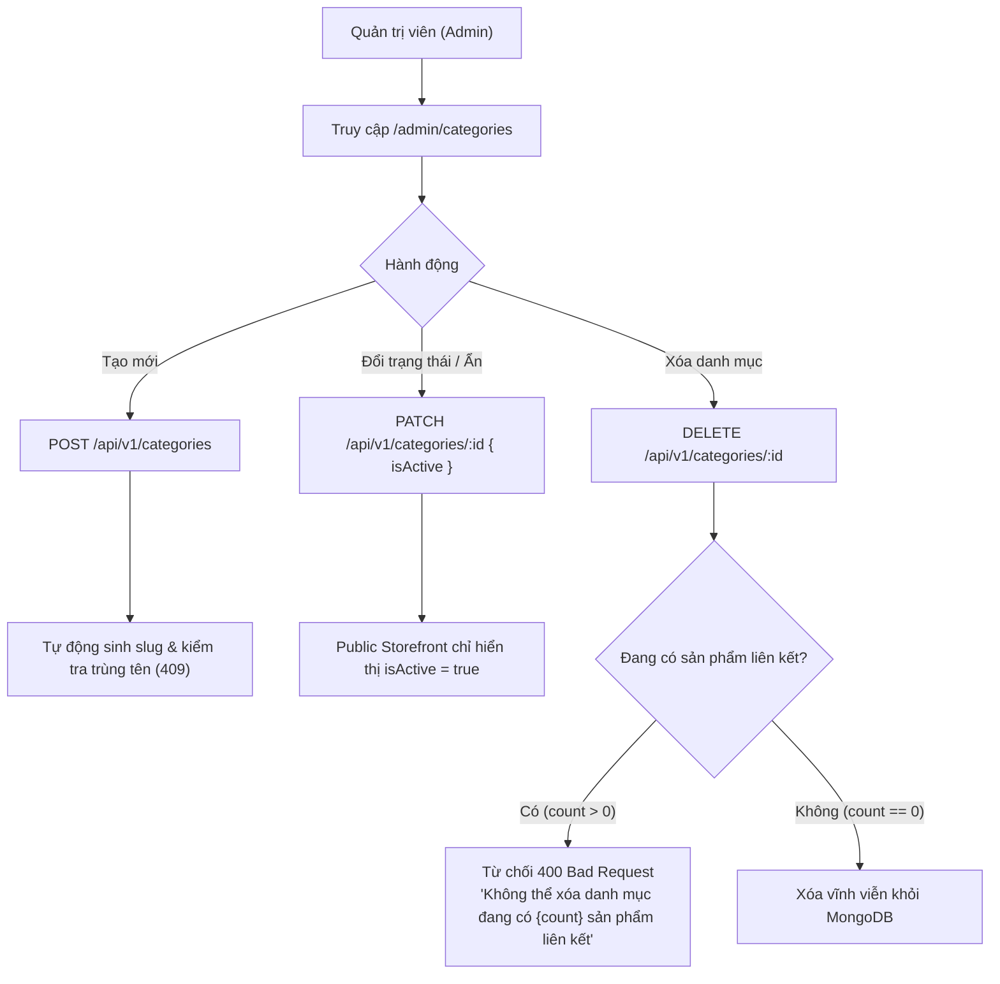
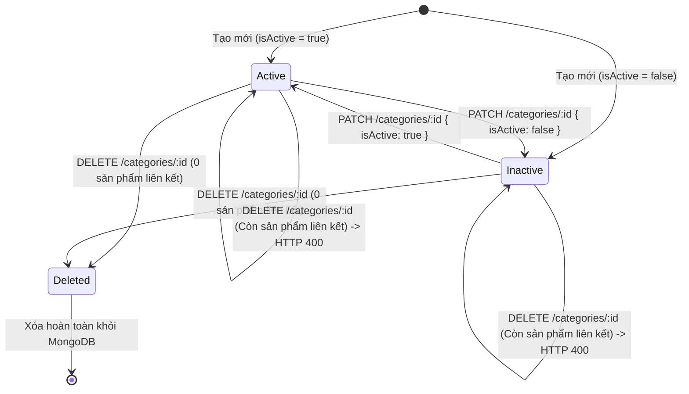

# Feature: Quản lý Category (Admin CRUD) (`US-CAT-001`)

> **User Story:** `US-CAT-001: Quản lý Category (Admin CRUD)`  
> **Slug:** `category-management`  
> **Epic:** `EPIC-02: Category & Product Catalog`  
> **Status:** **Completed & Production Ready (`v1.0`)**  
> **Baseline:** [.specify/features/category-management/baseline.md](file:///Users/vutuanhau/Documents/PROJECT/ecommerce-team/.specify/features/category-management/baseline.md)  
> **Release Notes:** [.specify/features/category-management/CHANGELOG.md](file:///Users/vutuanhau/Documents/PROJECT/ecommerce-team/.specify/features/category-management/CHANGELOG.md)  
> **Evaluation Report:** [.specify/features/category-management/evaluation-report.md](file:///Users/vutuanhau/Documents/PROJECT/ecommerce-team/.specify/features/category-management/evaluation-report.md) (Score: 4.88 / 5.00, Grade A+)

---

## 1. Overview & Business Value

Tính năng **Quản lý Category (Admin CRUD)** cung cấp công cụ quản trị danh mục sản phẩm toàn sàn tập trung cho Quản trị viên (Admin). Người bán hàng (`seller`) chỉ được chọn từ danh mục có sẵn do sàn định nghĩa nhằm chuẩn hóa cấu trúc dữ liệu sản phẩm, hỗ trợ tìm kiếm, phân loại và bộ lọc cho khách hàng trên toàn bộ sàn thương mại điện tử.

### Triết lý kiến trúc & Nghiệp vụ (Scope Boundaries):
- **Danh mục dùng chung toàn sàn**: Người bán không tự tạo danh mục riêng; chỉ Admin có quyền tạo, sửa, đổi trạng thái và xóa danh mục (`BR-CAT-001`).
- **Phân loại phẳng (Flat 1-Level Taxonomy)**: Cấu trúc danh mục đơn cấp, không phân nhánh lồng nhau (`parentId = null`) trong MVP Sprint 1 nhằm tối ưu hiệu năng và đơn giản hóa trải nghiệm điều hướng (`DEC-CAT-01`).
- **Tự động sinh Slug & Bất biến khi đổi tên**: `slug` được tự động chuyển đổi từ tiếng Việt có dấu sang định dạng kebab-case không dấu khi tạo mới qua hàm chuẩn hóa NFD. Khi Admin đổi tên danh mục qua `PATCH`, `slug` giữ nguyên tính bất biến để bảo vệ liên kết SEO và đường dẫn sản phẩm (`DEC-CAT-02`).
- **Phân tách rõ ràng giữa Xóa cứng và Ẩn danh mục**:
  - `DELETE /api/v1/categories/:id`: Thực hiện xóa cứng hoàn toàn khỏi cơ sở dữ liệu MongoDB nếu và chỉ nếu danh mục chưa có sản phẩm nào liên kết (`DEC-CAT-03`).
  - `isActive = false`: Khi muốn tạm ẩn danh mục trên giao diện người mua (Public Nav) mà vẫn giữ nguyên liên kết dữ liệu với các sản phẩm đang bán, Admin cập nhật trường `isActive = false` qua `PATCH` (`DEC-CAT-04`).
- **Bảo vệ toàn vẹn tham chiếu (Zero Orphaned Products)**: API xóa danh mục kiểm tra số lượng sản phẩm đang tham chiếu. Nếu có bất kỳ sản phẩm nào (dù đang active, draft hay blocked) liên kết, yêu cầu xóa sẽ bị từ chối với HTTP 400 Bad Request kèm thông báo số lượng sản phẩm liên kết (`DEC-CAT-05`, `BR-CAT-009`, `BR-CAT-010`).



---

## 2. Architecture & Data Model

### 2.1. Mongoose Schema (`Category`)

Collection: `categories`

```typescript
// backend/src/categories/schemas/category.schema.ts
@Schema({ timestamps: true })
export class Category {
  @Prop({
    required: true,
    unique: true,
    trim: true,
    minlength: 2,
    maxlength: 50,
  })
  name: string;

  @Prop({
    required: true,
    unique: true,
    trim: true,
    lowercase: true,
  })
  slug: string;

  @Prop({
    required: false,
    trim: true,
    maxlength: 500,
    default: '',
  })
  description?: string;

  @Prop({
    required: false,
    trim: true,
    default: null,
  })
  imageUrl?: string;

  @Prop({
    required: true,
    default: true,
    index: true,
  })
  isActive: boolean;
}
```

- **Collation Index:** `{ name: 1 }` với collation tiếng Việt `{ locale: 'vi', strength: 2 }` đảm bảo tính duy nhất không phân biệt hoa thường và dấu phụ.
- **Slug Index:** `{ slug: 1 }` đánh unique index phục vụ tra cứu URL thân thiện.
- **Active Index:** `{ isActive: 1 }` tối ưu hóa truy vấn storefront công khai.

### 2.2. Vòng đời trạng thái Danh mục (State Machine)



---

## 3. API Endpoints Reference

Tất cả các route yêu cầu tham số `:id` đều được bảo vệ bởi [`ParseObjectIdPipe`](file:///Users/vutuanhau/Documents/PROJECT/ecommerce-team/backend/src/common/pipes/parse-object-id.pipe.ts) nhằm ngăn chặn MongoDB CastError và trả về HTTP 400 Bad Request cho tham số không hợp lệ.

### 3.1. Lấy danh sách danh mục công khai (Storefront Nav)
- **Method & Route:** `GET /api/v1/categories`
- **Authentication:** Public (Không yêu cầu đăng nhập)
- **Query Filter:** `{ isActive: true }` có sắp xếp theo tiếng Việt (`collation: { locale: 'vi' }`, `sort: { name: 1 }`)
- **Response 200 OK:**
  ```json
  [
    {
      "_id": "6701a2b3c4d5e6f7a8b9c0d1",
      "name": "Thiết Bị Điện Tử",
      "slug": "thiet-bi-dien-tu",
      "description": "Điện thoại, máy tính bảng và phụ kiện",
      "imageUrl": "https://res.cloudinary.com/.../electronics.png",
      "isActive": true,
      "createdAt": "2026-10-06T00:00:00.000Z",
      "updatedAt": "2026-10-06T00:00:00.000Z"
    }
  ]
  ```

---

### 3.2. Lấy thông tin chi tiết danh mục theo Slug (Storefront Detail)
- **Method & Route:** `GET /api/v1/categories/:slug`
- **Authentication:** Public
- **Behavior:** Tìm kiếm danh mục theo slug; chỉ trả về nếu `isActive = true`. Nếu danh mục không tồn tại hoặc `isActive = false`, trả về `404 Not Found`.
- **Response 200 OK:** Category object tương ứng.

---

### 3.3. Lấy toàn bộ danh mục quản trị (Admin Catalog)
- **Method & Route:** `GET /api/v1/admin/categories`
- **Authentication:** Bearer JWT + `RolesGuard(Role.Admin)`
- **Response 200 OK:** Danh sách tất cả danh mục (gồm cả active và inactive) kèm trường tính toán `productCount`.
  ```json
  [
    {
      "_id": "6701a2b3c4d5e6f7a8b9c0d1",
      "name": "Thời Trang Nam",
      "slug": "thoi-trang-nam",
      "description": "Quần áo, phụ kiện nam",
      "imageUrl": "https://res.cloudinary.com/.../fashion.png",
      "isActive": true,
      "productCount": 12,
      "createdAt": "2026-10-06T00:00:00.000Z",
      "updatedAt": "2026-10-06T00:00:00.000Z"
    }
  ]
  ```

---

### 3.4. Tạo danh mục mới
- **Method & Route:** `POST /api/v1/categories`
- **Authentication:** Bearer JWT + `RolesGuard(Role.Admin)`
- **Request Body (`CreateCategoryDto`):**
  ```json
  {
    "name": "Thời Trang Nam",
    "description": "Quần áo, phụ kiện nam cao cấp",
    "imageUrl": "https://res.cloudinary.com/.../fashion.png",
    "isActive": true
  }
  ```
- **Response 201 Created:** Document danh mục vừa tạo kèm `slug: "thoi-trang-nam"`.
- **Lỗi thường gặp:**
  - `400 Bad Request`: `name` dưới 2 ký tự hoặc vượt quá 50 ký tự; `imageUrl` sai định dạng URL.
  - `409 Conflict`: Tên danh mục đã tồn tại trong hệ thống (kiểm tra collation tiếng Việt không phân biệt hoa thường/dấu).

---

### 3.5. Cập nhật thông tin danh mục
- **Method & Route:** `PATCH /api/v1/categories/:id`
- **Authentication:** Bearer JWT + `RolesGuard(Role.Admin)`
- **Param Validation:** `ParseObjectIdPipe` (bắt buộc 24 ký tự hex)
- **Request Body (`UpdateCategoryDto`):**
  ```json
  {
    "name": "Thời Trang Nam & Phụ Kiện",
    "description": "Mô tả bổ sung",
    "imageUrl": "https://res.cloudinary.com/.../fashion-updated.png",
    "isActive": false
  }
  ```
  *(Lưu ý: Không chấp nhận field `slug` trong payload; slug giữ nguyên tính bất biến).*
- **Response 200 OK:** Dữ liệu danh mục đã cập nhật; `slug` giữ nguyên không đổi.
- **Lỗi thường gặp:**
  - `400 Bad Request`: ID không phải MongoDB ObjectId hợp lệ hoặc cố tình gửi trường không hợp lệ.
  - `404 Not Found`: Không tìm thấy danh mục theo `:id`.
  - `409 Conflict`: Đổi sang tên trùng với một danh mục khác.

---

### 3.6. Xóa danh mục
- **Method & Route:** `DELETE /api/v1/categories/:id`
- **Authentication:** Bearer JWT + `RolesGuard(Role.Admin)`
- **Param Validation:** `ParseObjectIdPipe`
- **Response 200 OK (Khi 0 sản phẩm liên kết):**
  ```json
  {
    "success": true,
    "message": "Xóa danh mục thành công"
  }
  ```
- **Response 400 Bad Request (Khi có sản phẩm liên kết):**
  ```json
  {
    "statusCode": 400,
    "message": "Không thể xóa danh mục đang có 8 sản phẩm liên kết",
    "error": "Bad Request"
  }
  ```

---

## 4. Frontend & Stitch Screen Mappings

| Màn hình | Route / Vị trí | Chức năng | Stitch Screen Reference |
|---|---|---|---|
| **Admin Category List** | `/admin/categories` | Bảng quản lý danh mục, tìm kiếm, lọc theo trạng thái, nút pill "+ Thêm danh mục", badge trạng thái Aloe-10, thao tác sửa/xóa | `projects/6249429078653284294/screens/920a53a998bd4e8e8b0b16ec16a08793` |
| **Admin Delete Alert Modal** | Modal dialog | Cảnh báo khi xóa danh mục có sản phẩm liên kết (chế độ Blocked) hoặc xác nhận xóa vĩnh viễn (chế độ Permitted) | `projects/6249429078653284294/screens/4ff01870d2a9498b8f48f72196b0383c` |
| **Admin Category Form Drawer** | Right Slide-over Drawer | Form tạo mới / chỉnh sửa tên, preview tự động sinh slug tiếng Việt theo thời gian thực, khóa slug, ảnh thumbnail, mô tả và toggle active | `projects/6249429078653284294/screens/b3ff9a13af8b42c7b154bc1730ab9471` |
| **Public CategoryNav** | Storefront Header / Subnav | Thanh cuộn ngang pills hiển thị các danh mục đang active để lọc sản phẩm, hiệu ứng active Aloe-10 (`#c1fbd4`) | Storefront Navigation |

### Design System Compliance (`frontend/DESIGN.md`):
- **Nút bấm:** 100% pill shape (`rounded-full`), không dùng góc bo chữ nhật.
- **Màu nền canvas:** 2-canvas polarity (`bg-canvas-cream` / `#fbfbf5` và `bg-canvas-light` / `#ffffff`).
- **Badge trạng thái:** Hoạt động dùng Aloe-10 (`bg-[#c1fbd4]` + text `#1a5034`), Đang ẩn dùng Neutral (`bg-[#d4d4d8]` + text `#3f3f46`).
- **Đường kẻ:** Hairline border 1px (`#e4e4e7`).
- **Trải nghiệm A11y:** Touch target tối thiểu $\ge 44\text{px}$, phím `Escape` đóng modal/drawer.

---

## 5. Testing & Quality Verification

Feature được kiểm thử tự động toàn diện qua Jest (Backend) và Vitest (Frontend) với **83/83 test case đạt (100% Pass Rate)**.

### 5.1. Backend Test Suites (49 tests)
```bash
# Chạy toàn bộ test suites của module categories
cd backend
npm test -- src/categories

# Chạy test suite RolesGuard và ObjectId Pipe
npm test -- src/auth/guards/__tests__/roles.guard.spec.ts src/common/pipes/__tests__/parse-object-id.pipe.spec.ts
```

| Test Suite | File Kiểm Thử | Số lượng test | Trọng tâm kiểm thử |
|---|---|:---:|---|
| **Category Service** | `src/categories/__tests__/categories.service.spec.ts` | 17 | Auto-slug, collision suffix `-1`, collation sort, MongoDB 11000 race condition, chặn xóa khi có sản phẩm |
| **Category DTOs** | `src/categories/dto/__tests__/category-dto.spec.ts` | 10 | ValidationPipe, độ dài tên, định dạng URL, cấm ghi đè slug trong Update DTO |
| **ParseObjectId Pipe** | `src/common/pipes/__tests__/parse-object-id.pipe.spec.ts` | 7 | Kiểm tra định dạng 24 ký tự hex của MongoDB ObjectId, từ chối tham số lỗi |
| **Admin Controller** | `src/categories/__tests__/admin-categories.controller.spec.ts` | 6 | Admin CRUD routes, response shapes, phân quyền Bearer JWT |
| **Slugify Helper** | `src/categories/utils/__tests__/slugify.util.spec.ts` | 6 | Bỏ dấu tiếng Việt (`á, à, đ, Đ, ê, ô, ư...`), chuẩn hóa kebab-case |
| **Roles Guard** | `src/auth/guards/__tests__/roles.guard.spec.ts` | 4 | Bảo vệ route chỉ cho phép tài khoản có quyền `ADMIN` |
| **Public Controller** | `src/categories/__tests__/categories.controller.spec.ts` | 3 | Storefront `findActive` và `findBySlug` |

### 5.2. Frontend Test Suites (34 tests)
```bash
# Chạy toàn bộ test suites frontend
cd frontend
pnpm test
```

| Component / Service | File Kiểm Thử | Số lượng test | Trọng tâm kiểm thử |
|---|---|:---:|---|
| **AdminCategoryPage** | `src/pages/AdminCategoryPage/__tests__/AdminCategoryPage.test.tsx` | 10 | Bento stats cards, bộ lọc tìm kiếm & trạng thái, kích hoạt drawer, kích hoạt xóa |
| **Category Service** | `src/services/__tests__/category.service.test.ts` | 8 | React Query hooks, fetch danh sách, mutations tạo/sửa/xóa, cache invalidation |
| **CategoryFormDrawer** | `src/pages/AdminCategoryPage/__tests__/CategoryFormDrawer.test.tsx` | 7 | Form create/edit, preview sinh slug tức thì, khóa slug, Yup validation, xử lý 409 |
| **DeleteWarningDialog** | `src/pages/AdminCategoryPage/__tests__/DeleteWarningDialog.test.tsx` | 5 | Hiển thị cảnh báo chặn xóa khi `productCount > 0`, xác nhận xóa khi 0 SP, phím Escape |
| **CategoryNav** | `src/components/CategoryNav/__tests__/CategoryNav.test.tsx` | 4 | Storefront navigation bar, active pill highlight Aloe-10, cuộn ngang, fallback |

### 5.3. Static Analysis & Compilation Check
```bash
# Backend lint & typecheck
cd backend
npm run lint
npm run build

# Frontend lint & production build
cd frontend
pnpm run lint
pnpm run build
```
- **Linter Errors / Warnings:** **0 errors, 0 warnings**
- **TypeScript Errors:** **0 errors**
- **Build Status:** **Thành công 100%**

---

## 6. Specification & Delivery Artifacts Inventory

- **Intake:** [.specify/features/category-management/00-intake.md](file:///Users/vutuanhau/Documents/PROJECT/ecommerce-team/.specify/features/category-management/00-intake.md)
- **Tech Context:** [.specify/features/category-management/00-tech-context.md](file:///Users/vutuanhau/Documents/PROJECT/ecommerce-team/.specify/features/category-management/00-tech-context.md)
- **Elicitation Interview:** [.specify/features/category-management/01-elicitation.md](file:///Users/vutuanhau/Documents/PROJECT/ecommerce-team/.specify/features/category-management/01-elicitation.md)
- **Domain Model:** [.specify/features/category-management/02-domain-model.md](file:///Users/vutuanhau/Documents/PROJECT/ecommerce-team/.specify/features/category-management/02-domain-model.md)
- **Risk Register:** [.specify/features/category-management/03-risk-register.md](file:///Users/vutuanhau/Documents/PROJECT/ecommerce-team/.specify/features/category-management/03-risk-register.md)
- **User Stories:** [.specify/features/category-management/user-stories.md](file:///Users/vutuanhau/Documents/PROJECT/ecommerce-team/.specify/features/category-management/user-stories.md)
- **Technical Specification:** [.specify/features/category-management/spec.md](file:///Users/vutuanhau/Documents/PROJECT/ecommerce-team/.specify/features/category-management/spec.md)
- **Test Plan:** [.specify/features/category-management/test-plan.md](file:///Users/vutuanhau/Documents/PROJECT/ecommerce-team/.specify/features/category-management/test-plan.md)
- **Validation Report:** [.specify/features/category-management/validation-report.md](file:///Users/vutuanhau/Documents/PROJECT/ecommerce-team/.specify/features/category-management/validation-report.md)
- **Baseline Document:** [.specify/features/category-management/baseline.md](file:///Users/vutuanhau/Documents/PROJECT/ecommerce-team/.specify/features/category-management/baseline.md)
- **Implementation Plan:** [.specify/features/category-management/plan.md](file:///Users/vutuanhau/Documents/PROJECT/ecommerce-team/.specify/features/category-management/plan.md)
- **Tasks Breakdown (T001–T032 Complete):** [.specify/features/category-management/tasks.md](file:///Users/vutuanhau/Documents/PROJECT/ecommerce-team/.specify/features/category-management/tasks.md)
- **Adversarial Code Review Report:** [.specify/features/category-management/code-review-report.md](file:///Users/vutuanhau/Documents/PROJECT/ecommerce-team/.specify/features/category-management/code-review-report.md)
- **UI/UX & Design System Review Report:** [.specify/features/category-management/ui-review-report.md](file:///Users/vutuanhau/Documents/PROJECT/ecommerce-team/.specify/features/category-management/ui-review-report.md)
- **Deliverables Quality Evaluation Report:** [.specify/features/category-management/evaluation-report.md](file:///Users/vutuanhau/Documents/PROJECT/ecommerce-team/.specify/features/category-management/evaluation-report.md)
- **Changelog & Release Notes (v1.0):** [.specify/features/category-management/CHANGELOG.md](file:///Users/vutuanhau/Documents/PROJECT/ecommerce-team/.specify/features/category-management/CHANGELOG.md)
