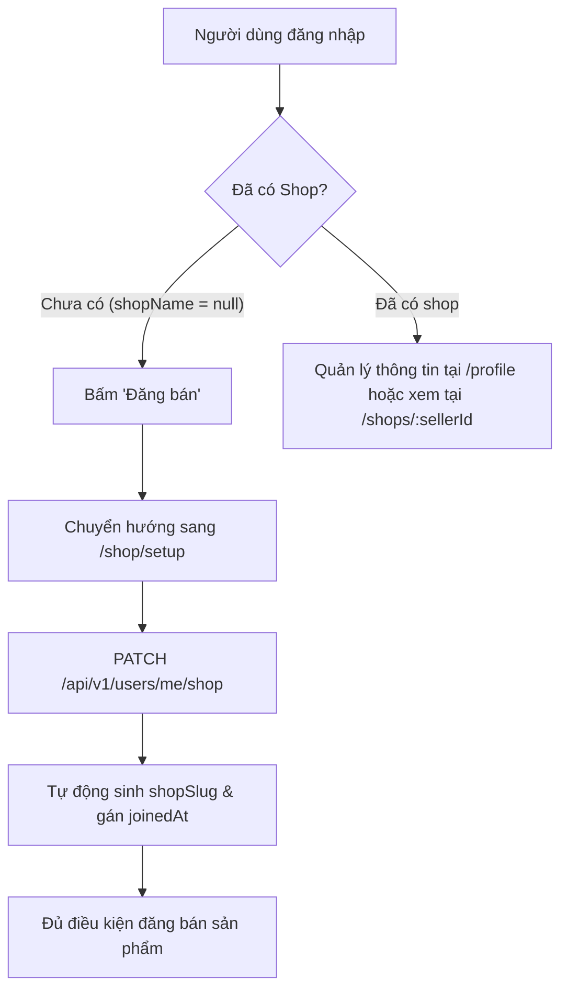
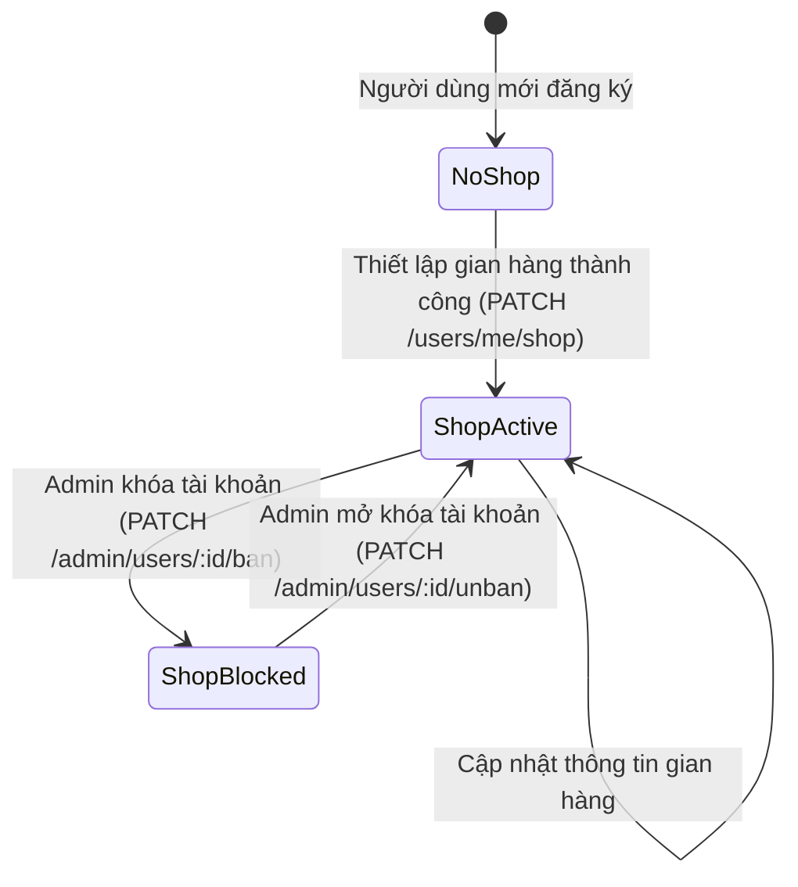

# Feature: Profile & Thiết lập gian hàng (`US-SELL-001`)

> **User Story:** `US-SELL-001: Profile & Thiết lập gian hàng`  
> **Slug:** `seller-shop-profile`  
> **Epic:** `EPIC-08: Seller (Gian hàng · Đăng bán · Xử lý đơn bán)`  
> **Status:** Completed (`Done [x]`)  
> **Baseline:** [.specify/features/seller-shop-profile/baseline.md](file:///Users/vutuanhau/Documents/PROJECT/ecommerce-team/.specify/features/seller-shop-profile/baseline.md)

---

## 1. Overview & Business Value

Tính năng **Profile & Thiết lập gian hàng** cho phép mọi người dùng đã đăng nhập (`customer`) quản lý hồ sơ cá nhân (họ tên, số điện thoại, địa chỉ) để tự động điền khi thanh toán (prefill checkout), đồng thời thiết lập gian hàng người bán (`shopName`, `pickupAddress`, `phone`) để đủ điều kiện đăng bán sản phẩm vật lý (`US-PRD-001`).

### Triết lý kiến trúc & Nghiệp vụ (Scope Boundaries):
- **Không có role `seller` riêng biệt**: Hệ thống sử dụng mô hình sàn C2C/B2C hội tụ theo thiết kế Shopee thu gọn. Bất kỳ tài khoản người dùng thông thường nào khi cập nhật thông tin shop đều trở thành người bán.
- **Không KYC / Không duyệt trước**: Người bán có thể đăng bán ngay sau khi hoàn thành thiết lập gian hàng.
- **Quan hệ 1:1 Người dùng – Gian hàng**: Mỗi tài khoản gắn liền với tối đa 1 gian hàng duy nhất lưu trữ dưới dạng sub-document trong `User` collection.
- **Định danh công khai (`shopSlug`)**: Hệ thống tự động chuẩn hóa và sinh `shopSlug` duy nhất cho từng shop để phục vụ URL công khai `/shops/:sellerId`. Khi trùng lặp tên, hệ thống tự động thêm hậu tố số tăng dần (`-2`, `-3`).
- **Cơ chế khóa tài khoản Admin (Ban cascade)**: Khi tài khoản bị Admin khóa (`isActive = false`), gian hàng công khai sẽ trả về `404 Not Found`, đồng thời tất cả sản phẩm của người bán lập tức bị chuyển sang trạng thái chặn (`isBlocked = true`, `blockReason = "seller_banned"`).



---

## 2. Architecture & Design Decisions

### 2.1. Data Model (Mongoose Schema)

Sub-document `shop` được tích hợp trực tiếp vào collection `User` (`users` collection trong MongoDB):

```typescript
// backend/src/users/schemas/user.schema.ts
export interface ShopSubDocument {
  shopName?: string;      // Tên gian hàng (3-50 ký tự)
  shopSlug?: string;      // Slug URL duy nhất, tự động sinh
  pickupAddress?: string; // Địa chỉ lấy hàng (tối thiểu 10 ký tự)
  phone?: string;         // Số điện thoại liên hệ gian hàng (chuẩn VN)
  joinedAt?: Date;        // Ngày kích hoạt gian hàng (bất biến sau lần tạo đầu)
}
```

- **Optimistic Concurrency Control**: Trường `version: number` (mặc định 0) trên `User` schema tăng dần sau mỗi thao tác cập nhật (`PATCH /users/me` và `PATCH /users/me/shop`) để chống ghi đè dữ liệu đồng thời (trả về `409 Conflict` nếu phiên bản không khớp).
- **Unique Sparse Index**: Đánh index `{ 'shop.shopSlug': 1 }` với thuộc tính `sparse: true` và `unique: true` nhằm đảm bảo tính toàn vẹn định danh slug mà không ảnh hưởng các tài khoản chưa có shop.

### 2.2. Vòng đời trạng thái Gian hàng (State Machine)



### 2.3. Quy tắc nghiệp vụ cốt lõi (Business Rules)

| Mã Quy tắc | Nội dung quy định |
| :--- | :--- |
| **BR-SELL-001** | `shopName` bắt buộc từ 3 đến 50 ký tự, cho phép chứa ký tự có dấu, chữ hoa/thường và số. |
| **BR-SELL-002** | `shopSlug` tự động chuyển đổi sang chữ thường không dấu, thay khoảng trắng bằng gạch nối `-`. Khi trùng slug, tự động đánh số tăng dần (`slug-2`, `slug-3`). |
| **BR-SELL-003** | `pickupAddress` tự do nhưng tối thiểu 10 ký tự để đảm bảo đủ thông tin lấy hàng. |
| **BR-SELL-004** | `phone` tuân thủ regex định dạng số điện thoại Việt Nam: `^(\+84\|0)[0-9]{9,10}$`. |
| **BR-SELL-005** | Thiết lập gian hàng yêu cầu gửi đồng thời cả 3 trường `shopName`, `pickupAddress`, `phone`. |
| **BR-SELL-006** | `GET /shops/:sellerId` trả về `404 Not Found` nếu người dùng chưa thiết lập gian hàng hoặc tài khoản đang bị khóa (`isActive = false`). |
| **BR-SELL-007** | `productCount` của shop công khai chỉ đếm các sản phẩm hợp lệ: `sellerId = :sellerId` VÀ `isActive = true` VÀ `isBlocked = false`. |
| **BR-SELL-008** | Quan hệ 1:1, một tài khoản chỉ sở hữu tối đa một gian hàng. |
| **BR-SELL-009** | `joinedAt` chỉ được khởi tạo ở lần đầu tạo gian hàng và giữ nguyên khi cập nhật. |
| **BR-SELL-010** | Khi Admin khóa tài khoản người bán, giao dịch MongoDB (Transaction) đồng thời chuyển `user.isActive = false` và chặn tất cả sản phẩm của người bán với lý do `blockReason = "seller_banned"`. Khi mở khóa, chỉ các sản phẩm có lý do này mới được phục hồi. |

---

## 3. API Endpoints Reference

### 3.1. Lấy thông tin cá nhân & Gian hàng hiện tại

- **Method & Route:** `GET /api/v1/users/me`
- **Authentication:** Bearer JWT (`JwtAuthGuard`)
- **Headers:** `Authorization: Bearer <accessToken>`
- **Response 200 OK (Đã thiết lập gian hàng):**
  ```json
  {
    "id": "66a1b2c3d4e5f6789012345",
    "email": "seller@example.com",
    "fullName": "Nguyễn Văn A",
    "phone": "0901234567",
    "address": "123 Lê Lợi, Phường Bến Nghé, Quận 1, TP.HCM",
    "role": "customer",
    "isActive": true,
    "version": 1,
    "shop": {
      "shopName": "Cửa Hàng Công Nghệ",
      "shopSlug": "cua-hang-cong-nghe",
      "pickupAddress": "123 Lê Lợi, Phường Bến Nghé, Quận 1, TP.HCM",
      "joinedAt": "2026-10-05T10:00:00.000Z"
    }
  }
  ```
- **Response 200 OK (Chưa thiết lập gian hàng):**
  ```json
  {
    "id": "66a1b2c3d4e5f6789012345",
    "email": "buyer@example.com",
    "fullName": "Trần Thị B",
    "phone": null,
    "address": null,
    "role": "customer",
    "isActive": true,
    "version": 0,
    "shop": null
  }
  ```
- **Lỗi thường gặp:**
  - `401 Unauthorized`: Token không hợp lệ hoặc đã hết hạn.
  - `403 Forbidden`: Tài khoản đã bị khóa (`isActive = false`).

---

### 3.2. Cập nhật hồ sơ cá nhân

- **Method & Route:** `PATCH /api/v1/users/me`
- **Authentication:** Bearer JWT (`JwtAuthGuard`)
- **Request Body (`UpdateProfileDto`):**
  ```json
  {
    "fullName": "Nguyễn Văn A Mới",
    "phone": "0987654321",
    "address": "456 Nguyễn Huệ, Quận 1, TP.HCM"
  }
  ```
- **Validation Rules:**
  - `fullName`: chuỗi, độ dài 2-100 ký tự (tuỳ chọn).
  - `phone`: regex định dạng SĐT Việt Nam `^(\+84|0)[0-9]{9,10}$` (tuỳ chọn).
  - `address`: chuỗi tối đa 500 ký tự (tuỳ chọn).
- **Response 200 OK:** Dữ liệu profile sau khi cập nhật (phiên bản `version` tự tăng thêm 1).
- **Lỗi thường gặp:**
  - `400 Bad Request`: Sai định dạng SĐT hoặc độ dài trường không hợp lệ.
  - `409 Conflict`: Dữ liệu bị xung đột phiên bản cập nhật đồng thời.

---

### 3.3. Thiết lập hoặc cập nhật thông tin gian hàng

- **Method & Route:** `PATCH /api/v1/users/me/shop`
- **Authentication:** Bearer JWT (`JwtAuthGuard`)
- **Request Body (`SetupShopDto`):**
  ```json
  {
    "shopName": "Cửa Hàng Phụ Kiện ABC",
    "pickupAddress": "789 Điện Biên Phủ, Phường 25, Quận Bình Thạnh, TP.HCM",
    "phone": "0912345678"
  }
  ```
- **Validation Rules:**
  - `shopName`: Bắt buộc, 3–50 ký tự (`Tên gian hàng phải từ 3-50 ký tự`).
  - `pickupAddress`: Bắt buộc, tối thiểu 10 ký tự (`Địa chỉ lấy hàng tối thiểu 10 ký tự`).
  - `phone`: Bắt buộc, đúng định dạng SĐT Việt Nam (`Số điện thoại không hợp lệ`).
- **Response 200 OK:**
  ```json
  {
    "id": "66a1b2c3d4e5f6789012345",
    "email": "seller@example.com",
    "fullName": "Nguyễn Văn A",
    "phone": "0912345678",
    "address": "123 Lê Lợi, Quận 1, TP.HCM",
    "role": "customer",
    "isActive": true,
    "version": 2,
    "shop": {
      "shopName": "Cửa Hàng Phụ Kiện ABC",
      "shopSlug": "cua-hang-phu-kien-abc",
      "pickupAddress": "789 Điện Biên Phủ, Phường 25, Quận Bình Thạnh, TP.HCM",
      "joinedAt": "2026-10-05T10:00:00.000Z"
    }
  }
  ```
- **Lỗi thường gặp:**
  - `400 Bad Request`: Thiếu trường bắt buộc hoặc validation thất bại.
  - `409 Conflict`: Xung đột ghi đè đồng thời hoặc slug collision không thể giải quyết.

---

### 3.4. Xem trang gian hàng công khai

- **Method & Route:** `GET /api/v1/shops/:sellerId`
- **Authentication:** Public (Không yêu cầu xác thực)
- **Path Parameters:**
  - `sellerId`: MongoDB ObjectId của người bán.
- **Response 200 OK:**
  ```json
  {
    "sellerId": "66a1b2c3d4e5f6789012345",
    "shopName": "Cửa Hàng Phụ Kiện ABC",
    "shopSlug": "cua-hang-phu-kien-abc",
    "joinedAt": "2026-10-05T10:00:00.000Z",
    "productCount": 12
  }
  ```
- **Response 404 Not Found:**
  ```json
  {
    "statusCode": 404,
    "message": "Không tìm thấy gian hàng"
  }
  ```
  *(Trả về khi `sellerId` không hợp lệ, người dùng chưa có shop, hoặc tài khoản người bán bị khóa).*

---

### 3.5. Admin Moderation (Khóa / Mở khóa tài khoản)

- **Method & Route:**
  - Khóa: `PATCH /api/v1/admin/users/:id/ban`
  - Mở khóa: `PATCH /api/v1/admin/users/:id/unban`
- **Authentication:** Bearer JWT (Admin role)
- **Behavior:**
  - Thao tác thực hiện trong một MongoDB Session / Transaction nhằm đảm bảo tính toàn vẹn dữ liệu.
  - Khóa: Gán `isActive = false`, chặn toàn bộ sản phẩm của seller sang `isBlocked = true`, gán `blockReason = "seller_banned"`.
  - Mở khóa: Gán `isActive = true`, khôi phục các sản phẩm có `blockReason = "seller_banned"` sang `isBlocked = false`. Các sản phẩm bị chặn do vi phạm khác (`policy_violation`) vẫn giữ nguyên trạng thái bị chặn.

---

## 4. Frontend Integration & How-To Guide

### 4.1. Dịch vụ API & React Query Hooks

Các hàm gọi API và TanStack Query hooks được định nghĩa tập trung:

- **[userService](file:///Users/vutuanhau/Documents/PROJECT/ecommerce-team/frontend/src/services/user.service.ts)**:
  - `userService.useGetProfile()`: Hook lấy thông tin profile người dùng, tự động quản lý cache `['user', 'profile']`.
  - `userService.useUpdateProfile()`: Mutation cập nhật thông tin cá nhân.
  - `userService.useSetupShop()`: Mutation tạo/sửa thông tin gian hàng.
- **[shopService](file:///Users/vutuanhau/Documents/PROJECT/ecommerce-team/frontend/src/services/shop.service.ts)**:
  - `shopService.useGetPublicShop(sellerId)`: Hook xem thông tin công khai gian hàng.

### 4.2. Các trang và luồng điều hướng

| Route | Component | Chức năng | Stitch Screen Mock Reference |
| :--- | :--- | :--- | :--- |
| `/profile` | [ProfilePage](file:///Users/vutuanhau/Documents/PROJECT/ecommerce-team/frontend/src/pages/ProfilePage/ProfilePage.tsx) | Xem và chỉnh sửa thông tin hồ sơ cá nhân; hiển thị tình trạng shop (đã có shop hoặc nút đăng ký shop). | `projects/6249429078653284294/screens/9050b988ae13463ca6d2c730b07b15b4` (Hồ sơ cá nhân #1 đến #5) |
| `/shop/setup` | [ShopSetupPage](file:///Users/vutuanhau/Documents/PROJECT/ecommerce-team/frontend/src/pages/ShopSetupPage/ShopSetupPage.tsx) | Form thiết lập tên gian hàng, địa chỉ lấy hàng và số điện thoại liên hệ. | `projects/6249429078653284294/screens/83f84aab39b040cfbf1b4b8dd51895ea` (Thiết lập gian hàng #1 đến #5) |
| `/shops/:sellerId` | [PublicShopPage](file:///Users/vutuanhau/Documents/PROJECT/ecommerce-team/frontend/src/pages/PublicShopPage/PublicShopPage.tsx) | Trang chủ shop công khai hiển thị tên shop, slug, ngày tham gia và tổng số lượng sản phẩm đang mở bán. | `projects/6249429078653284294/screens/e1730c574a0543949db609de5e978b55` (Gian hàng #1) |

### 4.3. Nút điều hướng "Đăng bán" trên Navbar

Tại [Navbar/index.tsx](file:///Users/vutuanhau/Documents/PROJECT/ecommerce-team/frontend/src/components/Navbar/index.tsx), nút "Đăng bán" được thiết kế dạng pill button theo chuẩn Design Token (`rounded-full px-3.5 py-1 text-xs font-medium text-foreground hover:bg-accent border border-black/20 dark:border-white/20`). Khi người dùng nhấn nút, nếu tài khoản chưa có shop, hệ thống sẽ điều hướng trực tiếp đến `/shop/setup`.

### 4.4. Chuẩn thiết kế UI (DESIGN.md Tokens Compliance)

- **Shape & Controls**: Tất cả nút bấm hành động đều sử dụng phong cách pill button bo tròn toàn phần (`rounded-full`).
- **2-Canvas Polarity**: Sử dụng nền sáng trắng (`bg-white` / `bg-background`) tương phản với viền xám hairline siêu mỏng 1px (`border-black/10` hoặc `border-border`).
- **Typography**: Cấu hình font chữ hỗ trợ `ss03` stylistic set, phân cấp rõ ràng giữa tiêu đề section và nhãn input.
- **Accessibility (WCAG 2.1 AA)**: Ghép cặp đầy đủ `id` và `htmlFor` giữa label và input; hỗ trợ ARIA live regions cho thông báo lỗi validation; hỗ trợ điều hướng bàn phím hoàn chỉnh.

---

## 5. Verification & Test Traceability

### 5.1. Lệnh thực thi kiểm thử Backend

```bash
cd backend && npm test -- users.service.spec.ts shops.service.spec.ts admin-users.controller.spec.ts users.controller.spec.ts shops.controller.spec.ts setup-shop.dto.spec.ts update-profile.dto.spec.ts validation.pipe.spec.ts
```

### 5.2. Ma trận truy vết kiểm thử (Test Traceability Matrix)

| Test Case ID | Yêu cầu / Kịch bản kiểm thử | Loại kiểm thử | Trạng thái | File kiểm thử thực thi |
| :--- | :--- | :---: | :---: | :--- |
| **TC-SELL-001** | `GET /users/me` trả về thông tin cá nhân kèm shop đầy đủ (`shopName`, `shopSlug`, `pickupAddress`, `joinedAt`) | Unit & Controller | Passed | [users.service.spec.ts](file:///Users/vutuanhau/Documents/PROJECT/ecommerce-team/backend/src/users/__tests__/users.service.spec.ts), [users.controller.spec.ts](file:///Users/vutuanhau/Documents/PROJECT/ecommerce-team/backend/src/users/__tests__/users.controller.spec.ts) |
| **TC-SELL-002** | `GET /users/me` cho tài khoản chưa có shop trả về `shop: null` | Unit & Controller | Passed | [users.service.spec.ts](file:///Users/vutuanhau/Documents/PROJECT/ecommerce-team/backend/src/users/__tests__/users.service.spec.ts) |
| **TC-SELL-003** | `GET /users/me` cho tài khoản bị khóa (`isActive = false`) trả về `403 Forbidden` | Unit Guard | Passed | [jwt.strategy.spec.ts](file:///Users/vutuanhau/Documents/PROJECT/ecommerce-team/backend/src/auth/strategies/__tests__/jwt.strategy.spec.ts) |
| **TC-SELL-004** | `PATCH /users/me` cập nhật thành công họ tên, SĐT, địa chỉ và tăng version | Unit & Controller | Passed | [users.service.spec.ts](file:///Users/vutuanhau/Documents/PROJECT/ecommerce-team/backend/src/users/__tests__/users.service.spec.ts) |
| **TC-SELL-005** | `PATCH /users/me` từ chối SĐT không đúng chuẩn Việt Nam (400 Bad Request) | DTO Validation | Passed | [update-profile.dto.spec.ts](file:///Users/vutuanhau/Documents/PROJECT/ecommerce-team/backend/src/users/dto/__tests__/update-profile.dto.spec.ts) |
| **TC-SELL-006** | `PATCH /users/me` từ chối họ tên dưới 2 ký tự (400 Bad Request) | DTO Validation | Passed | [update-profile.dto.spec.ts](file:///Users/vutuanhau/Documents/PROJECT/ecommerce-team/backend/src/users/dto/__tests__/update-profile.dto.spec.ts) |
| **TC-SELL-007** | `PATCH /users/me/shop` thiết lập gian hàng lần đầu, tự sinh `shopSlug`, gán `joinedAt` | Unit & Controller | Passed | [users.service.spec.ts](file:///Users/vutuanhau/Documents/PROJECT/ecommerce-team/backend/src/users/__tests__/users.service.spec.ts) |
| **TC-SELL-008** | `PATCH /users/me/shop` báo lỗi khi `shopName` dưới 3 ký tự | DTO Validation | Passed | [setup-shop.dto.spec.ts](file:///Users/vutuanhau/Documents/PROJECT/ecommerce-team/backend/src/users/dto/__tests__/setup-shop.dto.spec.ts) |
| **TC-SELL-009** | `PATCH /users/me/shop` báo lỗi khi `shopName` vượt quá 50 ký tự | DTO Validation | Passed | [setup-shop.dto.spec.ts](file:///Users/vutuanhau/Documents/PROJECT/ecommerce-team/backend/src/users/dto/__tests__/setup-shop.dto.spec.ts) |
| **TC-SELL-010** | `PATCH /users/me/shop` báo lỗi khi `pickupAddress` dưới 10 ký tự | DTO Validation | Passed | [setup-shop.dto.spec.ts](file:///Users/vutuanhau/Documents/PROJECT/ecommerce-team/backend/src/users/dto/__tests__/setup-shop.dto.spec.ts) |
| **TC-SELL-011** | `PATCH /users/me/shop` báo lỗi khi `phone` sai định dạng Việt Nam | DTO Validation | Passed | [setup-shop.dto.spec.ts](file:///Users/vutuanhau/Documents/PROJECT/ecommerce-team/backend/src/users/dto/__tests__/setup-shop.dto.spec.ts) |
| **TC-SELL-012** | `PATCH /users/me/shop` tự động sinh hậu tố `-2`, `-3` khi trùng lặp `shopSlug` | Unit Service | Passed | [users.service.spec.ts](file:///Users/vutuanhau/Documents/PROJECT/ecommerce-team/backend/src/users/__tests__/users.service.spec.ts) |
| **TC-SELL-013** | `PATCH /users/me/shop` cập nhật lại thông tin shop đã có, giữ nguyên `joinedAt` ban đầu | Unit Service | Passed | [users.service.spec.ts](file:///Users/vutuanhau/Documents/PROJECT/ecommerce-team/backend/src/users/__tests__/users.service.spec.ts) |
| **TC-SELL-014** | `GET /shops/:sellerId` (công khai) trả về thông tin gian hàng và số sản phẩm | Unit & Controller | Passed | [shops.service.spec.ts](file:///Users/vutuanhau/Documents/PROJECT/ecommerce-team/backend/src/shops/__tests__/shops.service.spec.ts), [shops.controller.spec.ts](file:///Users/vutuanhau/Documents/PROJECT/ecommerce-team/backend/src/shops/__tests__/shops.controller.spec.ts) |
| **TC-SELL-015** | `GET /shops/:sellerId` trả về `404 Not Found` khi tài khoản seller bị khóa (`isActive = false`) | Unit & Controller | Passed | [shops.service.spec.ts](file:///Users/vutuanhau/Documents/PROJECT/ecommerce-team/backend/src/shops/__tests__/shops.service.spec.ts) |
| **TC-SELL-016** | `GET /shops/:sellerId` trả về `404 Not Found` khi user chưa có `shopName` | Unit & Controller | Passed | [shops.service.spec.ts](file:///Users/vutuanhau/Documents/PROJECT/ecommerce-team/backend/src/shops/__tests__/shops.service.spec.ts) |
| **TC-SELL-017** | `GET /shops/:sellerId` chỉ đếm các sản phẩm có `isActive = true` và `isBlocked = false` | Unit Service | Passed | [shops.service.spec.ts](file:///Users/vutuanhau/Documents/PROJECT/ecommerce-team/backend/src/shops/__tests__/shops.service.spec.ts) |
| **TC-SELL-018** | `PATCH /admin/users/:id/ban` khóa tài khoản và chặn cascade toàn bộ sản phẩm với lý do `seller_banned` | Admin Controller Unit | Passed | [admin-users.controller.spec.ts](file:///Users/vutuanhau/Documents/PROJECT/ecommerce-team/backend/src/admin/__tests__/admin-users.controller.spec.ts) |
| **TC-SELL-019** | `PATCH /admin/users/:id/unban` mở khóa tài khoản và khôi phục sản phẩm bị chặn do ban | Admin Controller Unit | Passed | [admin-users.controller.spec.ts](file:///Users/vutuanhau/Documents/PROJECT/ecommerce-team/backend/src/admin/__tests__/admin-users.controller.spec.ts) |
| **TC-SELL-020** | `PATCH /admin/users/:id/unban` bảo lưu các sản phẩm bị chặn do lý do khác (`policy_violation`) | Admin Controller Unit | Passed | [admin-users.controller.spec.ts](file:///Users/vutuanhau/Documents/PROJECT/ecommerce-team/backend/src/admin/__tests__/admin-users.controller.spec.ts) |

---

## 6. Files Changed & Artifacts Inventory

| Phân hệ | Đường dẫn File | Mô tả thay đổi / Trách nhiệm |
| :--- | :--- | :--- |
| **Backend** | [user.schema.ts](file:///Users/vutuanhau/Documents/PROJECT/ecommerce-team/backend/src/users/schemas/user.schema.ts) | Thêm sub-document `shop`, `version`, unique sparse index trên `shop.shopSlug` |
| **Backend** | [users.service.ts](file:///Users/vutuanhau/Documents/PROJECT/ecommerce-team/backend/src/users/users.service.ts) | Bổ sung `getProfile()`, `updateProfile()`, `setupShop()`, hàm sinh slug tiếng Việt |
| **Backend** | [users.controller.ts](file:///Users/vutuanhau/Documents/PROJECT/ecommerce-team/backend/src/users/users.controller.ts) | Khai báo các endpoint `GET /users/me`, `PATCH /users/me`, `PATCH /users/me/shop` |
| **Backend** | [get-profile.dto.ts](file:///Users/vutuanhau/Documents/PROJECT/ecommerce-team/backend/src/users/dto/get-profile.dto.ts) | Định nghĩa DTO phản hồi thông tin cá nhân và shop profile |
| **Backend** | [update-profile.dto.ts](file:///Users/vutuanhau/Documents/PROJECT/ecommerce-team/backend/src/users/dto/update-profile.dto.ts) | Validation DTO cập nhật profile người dùng (họ tên, phone VN, địa chỉ) |
| **Backend** | [setup-shop.dto.ts](file:///Users/vutuanhau/Documents/PROJECT/ecommerce-team/backend/src/users/dto/setup-shop.dto.ts) | Validation DTO thiết lập gian hàng (`shopName`, `pickupAddress`, `phone`) |
| **Backend** | [shops.controller.ts](file:///Users/vutuanhau/Documents/PROJECT/ecommerce-team/backend/src/shops/shops.controller.ts) | Khai báo endpoint công khai `GET /shops/:sellerId` |
| **Backend** | [shops.service.ts](file:///Users/vutuanhau/Documents/PROJECT/ecommerce-team/backend/src/shops/shops.service.ts) | Truy vấn thông tin shop công khai và đếm sản phẩm khả dụng |
| **Backend** | [public-shop.dto.ts](file:///Users/vutuanhau/Documents/PROJECT/ecommerce-team/backend/src/shops/dto/public-shop.dto.ts) | Định nghĩa response DTO cho shop công khai |
| **Backend** | [admin-users.controller.ts](file:///Users/vutuanhau/Documents/PROJECT/ecommerce-team/backend/src/admin/admin-users.controller.ts) | Endpoint Admin ban/unban người dùng kèm transaction cascade chặn/mở sản phẩm |
| **Frontend** | [user.service.ts](file:///Users/vutuanhau/Documents/PROJECT/ecommerce-team/frontend/src/services/user.service.ts) | Service & TanStack Query hooks cho user profile & shop setup |
| **Frontend** | [shop.service.ts](file:///Users/vutuanhau/Documents/PROJECT/ecommerce-team/frontend/src/services/shop.service.ts) | Service & TanStack Query hook truy vấn public shop info |
| **Frontend** | [ProfilePage.tsx](file:///Users/vutuanhau/Documents/PROJECT/ecommerce-team/frontend/src/pages/ProfilePage/ProfilePage.tsx) | Trang quản lý hồ sơ cá nhân và trạng thái gian hàng |
| **Frontend** | [ProfileForm.tsx](file:///Users/vutuanhau/Documents/PROJECT/ecommerce-team/frontend/src/components/ProfileForm/ProfileForm.tsx) | Form cập nhật thông tin cá nhân với Formik & Yup validation |
| **Frontend** | [ShopSetupPage.tsx](file:///Users/vutuanhau/Documents/PROJECT/ecommerce-team/frontend/src/pages/ShopSetupPage/ShopSetupPage.tsx) | Trang thiết lập thông tin gian hàng |
| **Frontend** | [ShopSetupForm.tsx](file:///Users/vutuanhau/Documents/PROJECT/ecommerce-team/frontend/src/components/ShopSetupForm.tsx) | Form thiết lập gian hàng với validation & redirect sang đăng bán |
| **Frontend** | [PublicShopPage.tsx](file:///Users/vutuanhau/Documents/PROJECT/ecommerce-team/frontend/src/pages/PublicShopPage/PublicShopPage.tsx) | Trang hiển thị thông tin gian hàng công khai |
| **Frontend** | [Navbar/index.tsx](file:///Users/vutuanhau/Documents/PROJECT/ecommerce-team/frontend/src/components/Navbar/index.tsx) | Tích hợp nút pill "Đăng bán" dẫn đến trang thiết lập gian hàng |
| **Frontend** | [baseUrl.ts](file:///Users/vutuanhau/Documents/PROJECT/ecommerce-team/frontend/src/consts/baseUrl.ts) | Khai báo các đường dẫn `/profile`, `/shop/setup`, `/shops/:sellerId` |
| **Frontend** | [App.tsx](file:///Users/vutuanhau/Documents/PROJECT/ecommerce-team/frontend/src/App.tsx) | Đăng ký các Route mới trong cây router của ứng dụng |
