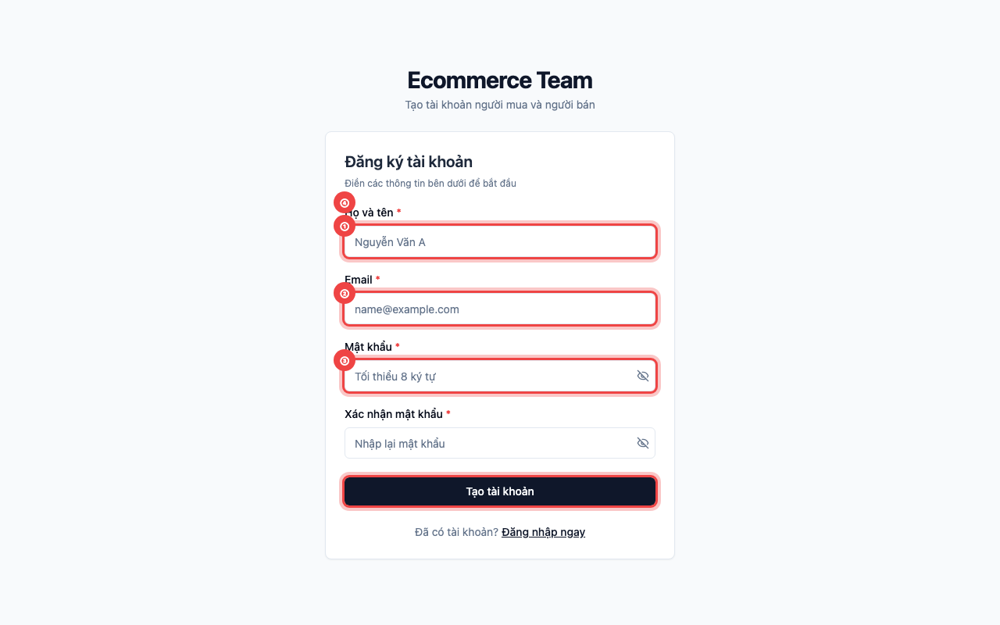
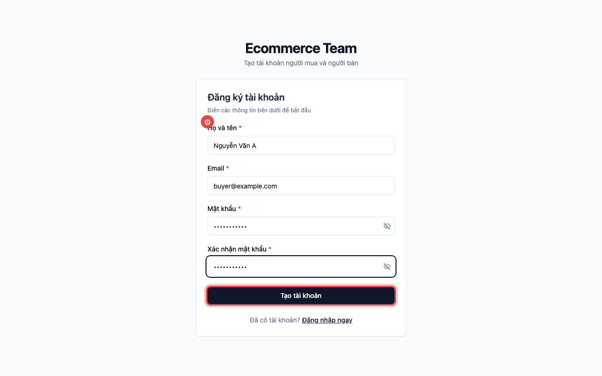
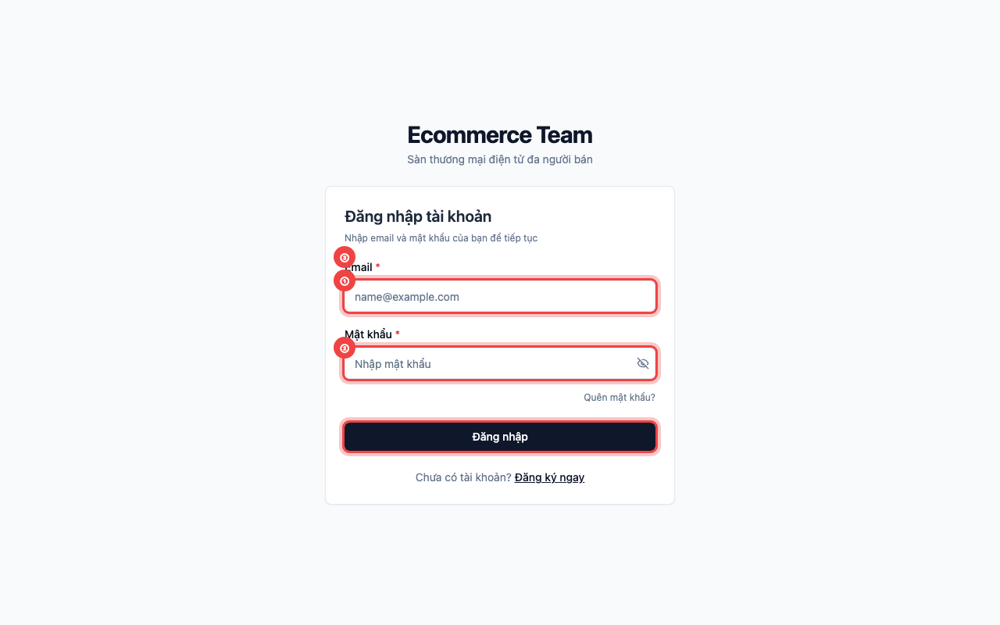
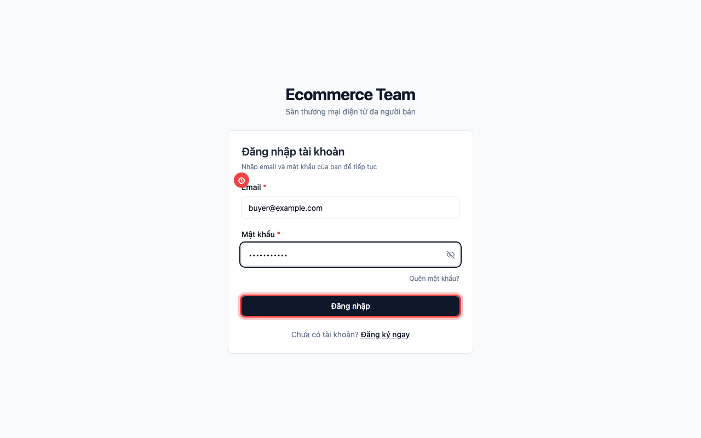

# 📖 Hướng Dẫn Sử Dụng: Đăng Ký & Đăng Nhập Tài Khoản

> **Đối tượng:** Khách hàng và Người bán trên sàn Ecommerce Team  
> **Cập nhật lần cuối:** 2026-10-04  
> **Tính năng:** `US-AUTH-001` (auth-register-login)

---

## 🎯 Giới thiệu tính năng

Hệ thống tài khoản Ecommerce Team giúp bạn dễ dàng tham gia mua sắm và đăng bán các sản phẩm. Chỉ với một tài khoản duy nhất, bạn vừa có thể đặt mua hàng từ nhiều người bán, vừa có thể thiết lập gian hàng để bán sản phẩm của mình.

---

## 🚀 Hướng dẫn từng bước

### Bước 1: Mở trang Đăng ký và điền thông tin

Khi bạn truy cập địa chỉ đăng ký tài khoản, giao diện sẽ xuất hiện các trường thông tin cần thiết:

- **① Nhập Họ và tên:** Nhập tên đầy đủ của bạn (ví dụ: _Nguyễn Văn A_). Tên này sẽ dùng để hiển thị trên hệ thống và tự động điền khi nhận hàng.
- **② Nhập địa chỉ Email:** Điền email cá nhân chính xác của bạn. Mỗi email chỉ được sử dụng cho một tài khoản duy nhất.
- **③ Nhập Mật khẩu:** Tạo mật khẩu an toàn có độ dài tối thiểu 8 ký tự.
- **④ Bấm nút "Tạo tài khoản":** Kiểm tra lại các thông tin và xác nhận gửi đăng ký.

---

### Bước 2: Hoàn tất đăng ký tài khoản

Sau khi điền đầy đủ và chính xác tất cả các trường:

- **① Bấm nút "Tạo tài khoản":** Hệ thống sẽ tiến hành khởi tạo tài khoản mới. Khi thành công, bạn sẽ nhận được thông báo xanh trên góc màn hình và được tự động chuyển sang trang Đăng nhập.

---

### Bước 3: Đăng nhập vào hệ thống

Tại trang Đăng nhập, bạn sử dụng email và mật khẩu vừa tạo:

- **① Nhập Email:** Điền email bạn đã đăng ký tài khoản.
- **② Nhập Mật khẩu:** Điền chính xác mật khẩu đã tạo.
- **③ Bấm nút "Đăng nhập":** Bắt đầu phiên làm việc và đăng nhập vào sàn thương mại điện tử.

---

### Bước 4: Đăng nhập thành công

Điền thông tin và đăng nhập:

- **① Bấm "Đăng nhập":** Hệ thống xác thực và đưa bạn về Trang chủ. Bạn đã sẵn sàng để mua sắm hoặc thiết lập gian hàng để bán sản phẩm!

---

## 💡 Mẹo hữu ích & Lưu ý an toàn

- **Độ dài mật khẩu:** Mật khẩu bắt buộc từ 8 ký tự trở lên. Nên kết hợp chữ hoa, chữ thường và chữ số để tăng tính bảo mật.
- **Biểu tượng con mắt 👁️:** Bấm vào biểu tượng mắt ở góc phải ô mật khẩu để kiểm tra lại các ký tự bạn vừa gõ nếu sợ nhập sai.
- **Tài khoản dùng chung:** Bạn không cần tạo hai tài khoản khác nhau cho việc mua và bán. Ngay sau khi đăng nhập, bạn có thể thiết lập gian hàng để đăng bán bất cứ lúc nào.

---

## ❓ Câu hỏi thường gặp (FAQ)

- **Q: Tại sao hệ thống báo lỗi "Email đã tồn tại trên hệ thống"?**  
  **A:** Email này đã được một tài khoản khác đăng ký trước đó. Bạn hãy kiểm tra lại xem mình đã có tài khoản chưa, hoặc bấm nút "Đăng nhập ngay" ở phía dưới.

- **Q: Tôi có cần xác nhận email qua thư gửi về hộp thư không?**  
  **A:** Không cần. Sau khi bấm đăng ký thành công, bạn có thể đăng nhập và sử dụng hệ thống ngay lập tức.

- **Q: Nếu tài khoản bị báo "Tài khoản đã bị khóa" thì phải làm sao?**  
  **A:** Đây là trường hợp tài khoản đã bị Quản trị viên (Admin) tạm khóa do vi phạm chính sách của sàn. Bạn vui lòng liên hệ với ban quản trị để được hỗ trợ mở khóa.
